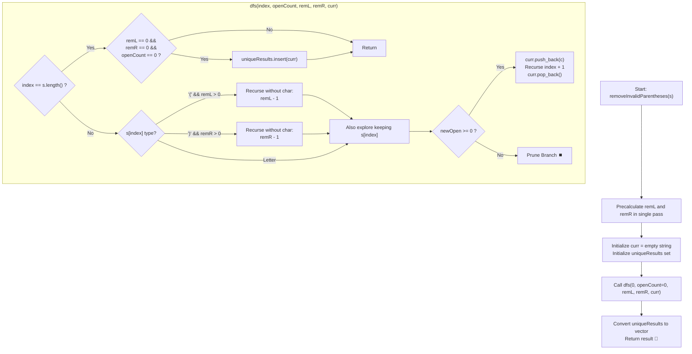

# 💡 Approach — Remove Invalid Parentheses

  | 📄 [Problem](./Problem.md) | 💡 [Approach](./Approach.md) | 🧩 [Solution](./Solution.cpp) | 🚀 [Main](./Main.cpp) |
  |:--------------------------:|:-----------------------------:|:------------------------------:|:---------------------:|

## 📊 Metadata

---

> [!TIP]
> **Core Intuition — Misplaced Deficit Counting & Pruned Backtracking / Level-Order BFS:**
> 1. **Precise Deletion Targets**:
>    Before generating subsets of removals, we determine the exact minimum deletions required. An unmatched `')'` cannot be resolved by future characters, so each premature `')'` increments `remR`. Unclosed `'('` increment `remL`. Any valid result with minimum deletions must remove exactly `remL` opening brackets and `remR` closing brackets.
> 2. **Targeted Depth-First Search with Early Pruning**:
>    At each index $i$ in string $s$:
>    - If $s[i]$ is `'('` and $\text{remL} > 0$, we can branch by deleting it.
>    - If $s[i]$ is `')'` and $\text{remR} > 0$, we can branch by deleting it.
>    - We can always branch by keeping $s[i]$ provided that the running balance of opening brackets `openCount` never drops below 0.
> 3. **Deduplication Strategy**:
>    Multiple removal sequences can produce identical strings. To prevent duplicate emissions, we can accumulate candidates in an `unordered_set<string>` and convert to a vector, or skip duplicate consecutive bracket deletions during transitions.

---

## 🔩 Step-by-Step Breakdown

### Method 1: Bounded Backtracking with Misplaced Bracket Counts ($\mathcal{O}(2^n)$ Time, $\mathcal{O}(n)$ Auxiliary Space) — Primary

1. **Calculate Minimum Deletions**:
   - Traverse the input string $s$ once:
     - If $c == \text{'('}$: `remL++`.
     - Else if $c == \text{')'}$:
       - If `remL > 0`: `remL--` (matched with earlier open bracket).
       - Else: `remR++` (unmatched closing bracket).

2. **Recursive Backtracking (`dfs(index, openCount, remL, remR, curr, uniqueResults)`)**:
   - **Terminal Condition**: When `index == s.length()`:
     - If `remL == 0 && remR == 0 && openCount == 0`:
       - Insert `curr` into `uniqueResults`.
     - Return.
   - **Branch A — Deletion**:
     - If $s[\text{index}] == \text{'('}$ and $\text{remL} > 0$:
       - Recurse: `dfs(index + 1, openCount, remL - 1, remR, curr, ...)`.
     - Else if $s[\text{index}] == \text{')'}$ and $\text{remR} > 0$:
       - Recurse: `dfs(index + 1, openCount, remL, remR - 1, curr, ...)`.
   - **Branch B — Retention**:
     - Append $s[\text{index}]$ to `curr`.
     - Calculate new balance:
       - If $s[\text{index}] == \text{'('}$, `newOpen = openCount + 1`.
       - Else if $s[\text{index}] == \text{')'}$, `newOpen = openCount - 1`.
       - Else (alphabetic letter), `newOpen = openCount`.
     - If `newOpen >= 0`:
       - Recurse: `dfs(index + 1, newOpen, remL, remR, curr, ...)`.
     - Backtrack: `curr.pop_back()`.

3. **Collection**:
   - Copy unique strings from `uniqueResults` into a vector.

---

### Method 2: Breadth-First Search (BFS) Level-Order Exploration ($\mathcal{O}(2^n)$ Time, $\mathcal{O}(2^n)$ Auxiliary Space) — Alternative

1. **State Space Representation**:
   - Each state in the queue is a string. The starting state is $s$ at depth 0.
   - Maintain an `unordered_set<string> visited` to avoid visiting duplicate strings.

2. **Level-by-Level Expansion**:
   - For all strings at the current queue level:
     - Check if the string is valid (i.e., balanced parentheses and letters).
     - If at least one valid string is found at this level, set `found = true` and collect it.
   - If `found == true`:
     - Stop expanding to further depths (all minimum removal strings have been found at this shortest depth).
   - If `found == false`:
     - For each string at this level, generate next-level candidates by removing one `'('` or `')'` at each position.
     - Enqueue unvisited candidates.

---

## 🔄 Mermaid Flowchart

---

## 🏃‍♂️ Dry Run

### Detailed Walkthrough: Example 1 (`s = "()())()"`)

- **Step 1 (Precomputation)**:
  - Scanning `s`:
    - `i=0: '(' -> remL = 1`
    - `i=1: ')' -> remL = 0`
    - `i=2: '(' -> remL = 1`
    - `i=3: ')' -> remL = 0`
    - `i=4: ')' -> remL = 0, remR = 1`
    - `i=5: '(' -> remL = 1`
    - `i=6: ')' -> remL = 0`
  - Result: `remL = 0`, `remR = 1`. Exactly one `')'` must be removed.

- **Step 2 (Backtracking Tree Branches for Deleting one `')'`)**:
  - Delete `s[1] = ')'`: yields `"(())(...)"` $\to$ balance drops to negative at index 3 $\to$ invalid.
  - Delete `s[3] = ')'`: string becomes `"()()()"` $\to$ balance stays $\ge 0$ throughout $\to$ **Valid! Insert `"()()()"`.**
  - Delete `s[4] = ')'`: string becomes `"(())()"` $\to$ balance stays $\ge 0$ throughout $\to$ **Valid! Insert `"(())()"`.**
  - Delete `s[6] = ')'`: leaves open bracket unclosed $\to$ invalid.

- **Output**: `["(())()", "()()()"]`.

---

## 📊 Complexity Analysis

| Complexity Metric | Estimation | Rationale |
| :--- | :---: | :--- |
| **Time Complexity** | $\mathcal{O}(2^n)$ | In the worst-case, every parenthesis presents two decisions (keep or delete). Precomputing `remL` and `remR` together with early balance pruning restricts recursion strictly to paths that can yield valid strings. Since $n \le 25$, $2^n$ is well within competitive programming limits ($\approx 10^5$ operations max). |
| **Auxiliary Space** | $\mathcal{O}(n)$ | The recursion stack depth and temporary path string `curr` are strictly bounded by the maximum string length $n \le 25$. |

---

> *"Perfection is achieved, not when there is nothing more to add, but when there is nothing left to take away."*

---

<h3>Happy Coding! 🚀</h3>

