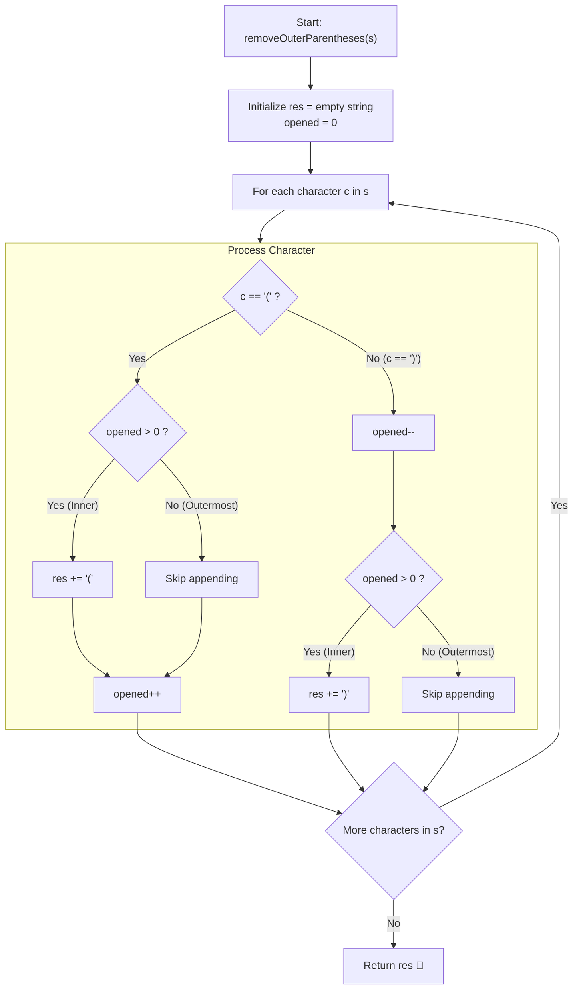

# 💡 Approach — Remove Outermost Parentheses

  | 📄 [Problem](./Problem.md) | 💡 [Approach](./Approach.md) | 🧩 [Solution](./Solution.cpp) | 🚀 [Main](./Main.cpp) |
  |:--------------------------:|:-----------------------------:|:------------------------------:|:---------------------:|

## 📊 Metadata

---

> [!TIP]
> **Core Intuition — Depth Tracking & Boundary Suppression:**
> 1. **Primitive Structure**:
>    A primitive valid parentheses string has the form `"(" + A + ")"`. The outermost parentheses are precisely:
>    - The opening `'('` at nesting depth $0 \to 1$.
>    - The closing `')'` at nesting depth $1 \to 0$.
> 2. **Filter Invariant**:
>    - If we encounter `'('`: it is an inner character if and only if the current depth `opened > 0` before incrementing.
>    - If we encounter `')'`: it is an inner character if and only if the current depth `opened > 1` before decrementing (or `opened > 0` after decrementing).
> 3. **Optimal In-Place Extraction**:
>    By maintaining an integer variable representing the current open depth, we can append characters directly to our result string in $\mathcal{O}(n)$ time without allocating auxiliary stack objects.

---

## 🔩 Step-by-Step Breakdown

### Method 1: Single Pass with Depth Counter ($\mathcal{O}(n)$ Time, $\mathcal{O}(1)$ Auxiliary Space) — Primary

1. **State Initialization**:
   - Initialize an empty string `res` to accumulate internal characters.
   - Initialize integer `opened = 0` representing current nesting depth.

2. **Iterate Across String**:
   - For each character `c` in `s`:
     - **Case 1: Opening Parenthesis (`c == '('`)**:
       - If `opened > 0`: it is not the outermost boundary of the primitive block. Append `c` to `res`.
       - Increment `opened++`.
     - **Case 2: Closing Parenthesis (`c == ')'`)**:
       - Decrement `opened--`.
       - If `opened > 0`: it is not the outermost closing boundary of the primitive block. Append `c` to `res`.

3. **Final Return**:
   - Return `res`.

---

### Method 2: Primitive Interval Slicing via Balance Tracking ($\mathcal{O}(n)$ Time, $\mathcal{O}(1)$ Auxiliary Space) — Alternative

1. **State Initialization**:
   - Track `balance = 0` and integer `start = 0` marking the beginning index of the current primitive block.
2. **Scan String**:
   - For each index $i$ from $0$ to $n - 1$:
     - If $s[i] == \text{'('}$, `balance++`.
     - Else, `balance--`.
     - If `balance == 0`:
       - A primitive valid block has closed on index $i$, covering $[ \text{start} \dots i ]$.
       - The outermost parentheses are $s[\text{start}]$ and $s[i]$.
       - Append substring $s[\text{start} + 1 \dots i - 1]$ to `res`.
       - Advance `start = i + 1`.
3. **Return Result**:
   - Return concatenated `res`.

---

## 🔄 Mermaid Flowchart

---

## 🏃‍♂️ Dry Run

### Detailed Walkthrough: Example 1 (`s = "(()())(())"`)

- **Input String**: `s = "(()())(())"` (Length $10$)
- **Primitives**:
  - Primitive 1: `"(()())"` (indices $0$ to $5$) $\to$ stripped gives `"()()"`
  - Primitive 2: `"(())"` (indices $6$ to $9$) $\to$ stripped gives `"()"`
- **Expected Output**: `"()()()"`

| Step | Index $i$ | Char $s[i]$ | `opened` (Before) | Condition Checked | Action | Append to `res`? | `opened` (After) | Current `res` |
|:---:|:---:|:---:|:---:|:---:|:---:|:---:|:---:|:---:|
| 1 | 0 | `'('` | 0 | `opened > 0` (False) | Outermost open | ❌ | 1 | `""` |
| 2 | 1 | `'('` | 1 | `opened > 0` (True) | Inner open | ✅ | 2 | `"("` |
| 3 | 2 | `')'` | 2 | `opened - 1 > 0` (True) | Inner close | ✅ | 1 | `"()"` |
| 4 | 3 | `'('` | 1 | `opened > 0` (True) | Inner open | ✅ | 2 | `"()("` |
| 5 | 4 | `')'` | 2 | `opened - 1 > 0` (True) | Inner close | ✅ | 1 | `"()()"` |
| 6 | 5 | `')'` | 1 | `opened - 1 == 0` | Outermost close | ❌ | 0 | `"()()"` |
| 7 | 6 | `'('` | 0 | `opened > 0` (False) | Outermost open | ❌ | 1 | `"()()"` |
| 8 | 7 | `'('` | 1 | `opened > 0` (True) | Inner open | ✅ | 2 | `"()()("` |
| 9 | 8 | `')'` | 2 | `opened - 1 > 0` (True) | Inner close | ✅ | 1 | `"()()()"` |
| 10 | 9 | `')'` | 1 | `opened - 1 == 0` | Outermost close | ❌ | 0 | `"()()()"` |

- **Final Answer**: `"()()()"`.

---

## 📊 Complexity Analysis

| Complexity Metric | Estimation | Rationale |
| :--- | :---: | :--- |
| **Time Complexity** | $\mathcal{O}(n)$ | We scan string $s$ of length $n$ exactly once. Each character involves $\mathcal{O}(1)$ comparison, arithmetic, and appending operations. |
| **Auxiliary Space** | $\mathcal{O}(1)$ | The counter `opened` uses $\mathcal{O}(1)$ additional memory. The output string `res` takes $\mathcal{O}(n)$ to store the answer, which is not auxiliary operational space. |

---

> *"The true essence of structure lies within; strip away the outermost shells and the symmetry remains untouched."*

---

<h3>Happy Coding! 🚀</h3>

