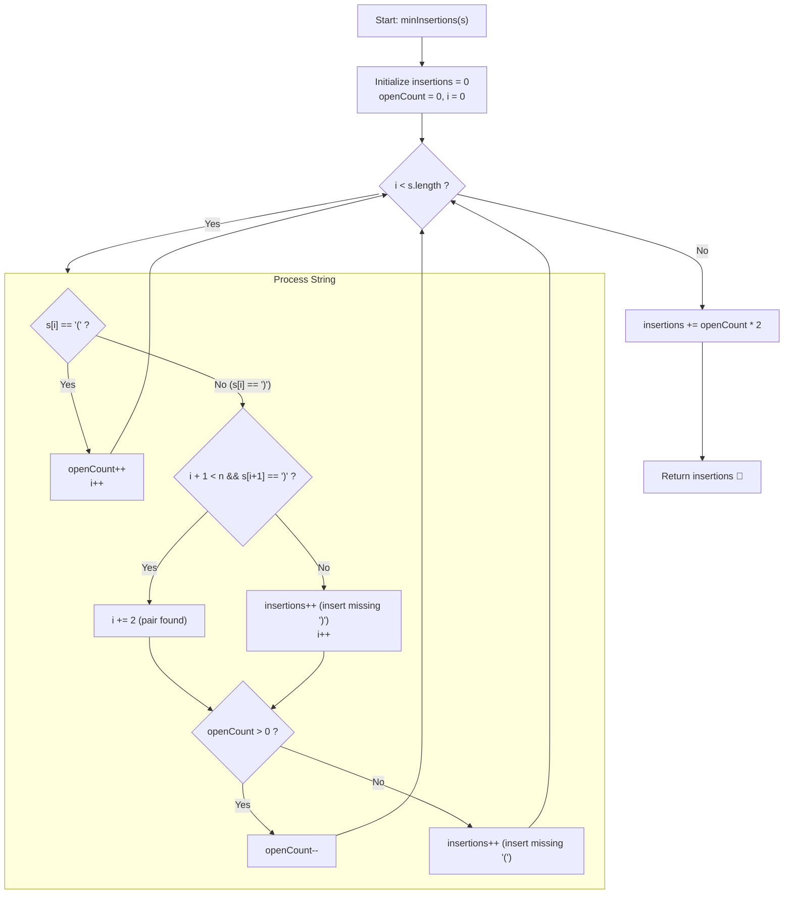

# 💡 Approach — Minimum Insertions to Balance a Parentheses String

  | 📄 [Problem](./Problem.md) | 💡 [Approach](./Approach.md) | 🧩 [Solution](./Solution.cpp) | 🚀 [Main](./Main.cpp) |
  |:--------------------------:|:-----------------------------:|:------------------------------:|:---------------------:|

## 📊 Metadata

---

> [!TIP]
> **Core Intuition — Greedy Consecutive Lookahead & Asymmetric Matching:**
> 1. **Atomic Grouping of Closing Parentheses**:
>    Because each `'('` strictly requires a consecutive pair `'))'`, closing parentheses must always be considered in chunks of two.
> 2. **Lookahead Pairing Strategy**:
>    When scanning left-to-right:
>    - Upon encountering `'('`: increment `openCount` (available unclosed openings).
>    - Upon encountering `')'`: check if the immediately next character $s[i + 1]$ is also `')'`.
>      - If yes: advance past it ($i++$), consuming the full `'))'` pair.
>      - If no: we only have a single `')'`, so we must insert $1$ closing parenthesis (`insertions++`) to make it `'))'`.
>    - Now that we have formed a complete `'))'` pair:
>      - If `openCount > 0`: match it with one previously opened `'('` (`openCount--`).
>      - If `openCount == 0`: no opening `'('` exists before this pair, so we must insert `'('` before it (`insertions++`).
> 3. **Post-Processing**:
>    At the end of traversal, any remaining `openCount` represents unclosed `'('`, each requiring two `')'`. Thus, add $2 \times \text{openCount}$ to `insertions`.

---

## 🔩 Step-by-Step Breakdown

### Method 1: Lookahead Consecutive Pair Greedy ($\mathcal{O}(n)$ Time, $\mathcal{O}(1)$ Auxiliary Space) — Primary

1. **State Initialization**:
   - `insertions = 0`: tracks the total count of inserted characters.
   - `openCount = 0`: tracks currently active, unmatched `'('` brackets.
2. **Linear Traversal with Conditional Step**:
   - For $i = 0$ to $n - 1$:
     - **Case A: $s[i] == \text{'('}$**:
       - Simply increment `openCount++`.
     - **Case B: $s[i] == \text{')'}$**:
       - Check if $i + 1 < n$ and $s[i + 1] == \text{')'}$.
         - If so, advance $i$ by $1$ ($i++$) to consume the adjacent `')'`.
         - Otherwise, we only have one `')'`, so increment `insertions++` to complete the pair.
       - Pair Resolution:
         - If `openCount > 0`, consume one open bracket (`openCount--`).
         - Else, we lack an opening bracket, so insert one `'('` (`insertions++`).
3. **Closing Trailing Openings**:
   - Add $2 \times \text{openCount}$ to `insertions`.
4. **Return Answer**:
   - Return `insertions`.

---

### Method 2: Demand-Driven State Machine (`neededRight` Counter) ($\mathcal{O}(n)$ Time, $\mathcal{O}(1)$ Space) — Alternative

1. **State Variables**:
   - `res = 0`: count of insertions.
   - `neededRight = 0`: count of `')'` required by preceding `'('`.
2. **Character-by-Character Transitions**:
   - For each character $c$ in $s$:
     - If $c == \text{'('}$:
       - If `neededRight` is odd (meaning a previous `'('` has only matched one `')'`), we cannot allow another `'('` to split the consecutive `'))'`.
         - Insert `')'`: `res++`, `neededRight--`.
       - Demand $2$ right brackets for this new `'('`: `neededRight += 2`.
     - Else ($c == \text{')'}$):
       - Decrement demand: `neededRight--`.
       - If `neededRight < 0`: we received a `')'` without any `'('` expecting it.
         - Insert `'('` before it: `res++`.
         - The inserted `'('` needs $2$ right brackets, but one is already consumed by the current `')'`, so `neededRight += 2` (setting `neededRight = 1`).
3. **Final Result**:
   - Return `res + neededRight`.

---

## 🔄 Mermaid Flowchart

---

## 🏃‍♂️ Dry Run

### Detailed Walkthrough: Example 3 (`s = "))())("`)

- **Input**: `s = "))())("` (Length $7$)
- **Initial State**: `insertions = 0`, `openCount = 0`

| Step | Index $i$ | Substring / Char | Condition | Action | `openCount` | `insertions` |
|:---:|:---:|:---:|:---:|:---:|:---:|:---:|
| 1 | 0 | `s[0..1] = "))"` | Next char is `')'` | Consumed as `'))'` ($i \to 1$). Since `openCount == 0`, insert `'('` | 0 | **1** |
| 2 | 2 | `s[2] = '('` | Open bracket | Increment `openCount` | 1 | 1 |
| 3 | 3 | `s[3..4] = "))"` | Next char is `')'` | Consumed as `'))'` ($i \to 4$). Since `openCount > 0`, match with `'('` | 0 | 1 |
| 4 | 5 | `s[5] = '('` | Open bracket | Increment `openCount` | 1 | 1 |
| 5 | 6 | End of loop | Loop terminates | `openCount = 1` remaining $\to$ insert $1 \times 2 = 2$ `')'` | 0 | **3** |

- **Constructed String**: `"()" + "))" + "()" + "))" + "()" + "))"` $\to$ `"())())())"`.
- **Total Insertions**: $3$.

---

## 📊 Complexity Analysis

| Complexity Metric | Estimation | Rationale |
| :--- | :---: | :--- |
| **Time Complexity** | $\mathcal{O}(n)$ | We iterate through the string of length $n$ with at most $n$ character evaluations. In Method 1, index $i$ advances by either $1$ or $2$ per step, visiting each character exactly once. |
| **Auxiliary Space** | $\mathcal{O}(1)$ | Only a few primitive integer counters (`insertions`, `openCount`, `i`) are maintained; no dynamic stack or heap allocation is required. |

---

> *"Balance is not about having everything equal at once, but ensuring every opening has its complete, harmonious closure."*

---

<h3>Happy Coding! 🚀</h3>

