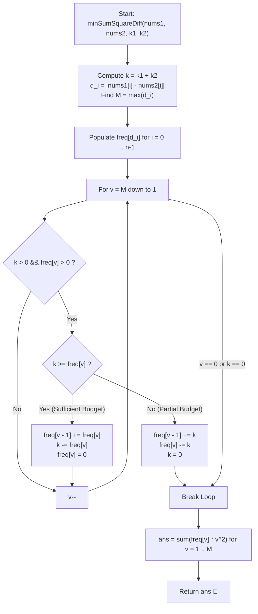

# 💡 Approach — Minimum Sum of Squared Difference

  | 📄 [Problem](./Problem.md) | 💡 [Approach](./Approach.md) | 🧩 [Solution](./Solution.cpp) | 🚀 [Main](./Main.cpp) |
  |:--------------------------:|:-----------------------------:|:------------------------------:|:---------------------:|

## 📊 Metadata

---

> [!TIP]
> **Core Intuition — Convexity & Greedy Bucket Reduction:**
> 1. **Pooled Operations Budget**:
>    Every modification by $+1$ or $-1$ on either $nums1[i]$ or $nums2[i]$ can reduce the absolute difference $d_i = |nums1[i] - nums2[i]|$ by $1$ (down to a minimum of $0$). Modifying either array yields identical results, so we have a unified operation budget:
>    $$k = k_1 + k_2$$
> 2. **Convexity of Quadratic Penalty**:
>    The function $f(x) = x^2$ is strictly convex. Decrementing an integer $x \to x - 1$ decreases its squared contribution by:
>    $$x^2 - (x - 1)^2 = 2x - 1$$
>    Since $2x - 1$ is strictly increasing in $x$, reducing larger differences yields strictly larger savings than reducing smaller differences. Hence, we must always greedily decrement the maximum available difference.
> 3. **Bucket Sort over Heap**:
>    Standard max-heap decrement costs $\mathcal{O}(k \log n)$ which TLEs for $k \le 2 \times 10^9$. However, $nums1[i], nums2[i] \le 10^5 \implies d_i \le 10^5$. We can store differences in a frequency array `freq` of size $M + 1$ (where $M \le 10^5$) and sweep downwards from $M$ to $1$, reducing all elements to level $v - 1$ in $\mathcal{O}(n + M)$ total time.

---

## 🔩 Step-by-Step Breakdown

### Method 1: Greedy Bucket Frequency Reduction ($\mathcal{O}(n + M)$ Time, $\mathcal{O}(M)$ Space) — Primary

1. **Calculate Differences & Max Value**:
   - Compute total budget: $k = k_1 + k_2$.
   - For each index $i \in [0, n - 1]$, compute $d_i = |nums1[i] - nums2[i]|$ and track $M = \max(d_i)$.
2. **Populate Frequency Bucket Array**:
   - Allocate `freq` array of size $M + 1$.
   - Increment `freq[d_i]++` for each difference.
3. **Descending Bucket Flattening**:
   - Iterate $v$ from $M$ down to $1$:
     - If `freq[v] == 0`, continue.
     - If remaining budget $k \ge \text{freq}[v]$:
       - All elements at level $v$ are decremented to $v - 1$.
       - `freq[v - 1] += freq[v]`.
       - `k -= freq[v]`.
       - `freq[v] = 0`.
     - Else ($k < \text{freq}[v]$):
       - Only $k$ elements can be decremented to $v - 1$.
       - `freq[v - 1] += k`.
       - `freq[v] -= k`.
       - `k = 0`.
       - Break immediately (budget exhausted).
4. **Compute Final Sum of Squared Differences**:
   - Initialize 64-bit accumulator `ans = 0`.
   - For $v = 1$ to $M$:
     - `ans += 1LL * freq[v] * v * v`.
   - Return `ans`.

---

### Method 2: Binary Search on Upper-Bound Threshold ($\mathcal{O}(n \log M)$ Time, $\mathcal{O}(1)$ Space) — Alternative

1. **Search Space Definition**:
   - Search for the minimum target ceiling $T \in [0, M]$ such that all $d_i > T$ can be reduced down to $T$ using at most $k$ operations.
2. **Feasibility Predicate**:
   - $\sum_{d_i > T} (d_i - T) \le k$.
3. **Remainder Allocation**:
   - After clamping all $d_i > T$ to $T$, use remaining operations $k' = k - \sum(d_i - T)$ to decrement some elements from $T$ down to $T - 1$.
4. **Sum of Squares Calculation**:
   - Accumulate squares of all adjusted differences.

---

## 🔄 Mermaid Flowchart

---

## 🏃‍♂️ Dry Run

### Detailed Walkthrough: Example 2 (`nums1 = [1,4,10,12]`, `nums2 = [5,8,6,9]`, `k1 = 1`, `k2 = 1`)

- **Unified Budget**: $k = k_1 + k_2 = 1 + 1 = 2$.
- **Differences**:
  - $d_0 = |1 - 5| = 4$
  - $d_1 = |4 - 8| = 4$
  - $d_2 = |10 - 6| = 4$
  - $d_3 = |12 - 9| = 3$
- **Frequencies**: `freq[4] = 3`, `freq[3] = 1`, all others $0$. $M = 4$.

| Step / $v$ | Current $k$ | `freq[v]` | Condition | Action Taken | Updated `freq` | New $k$ |
|:---:|:---:|:---:|:---:|:---:|:---:|:---:|
| $v = 4$ | 2 | 3 | $k < \text{freq}[4]$ ($2 < 3$) | Decrement $k = 2$ items from 4 to 3 | `freq[4] = 3 - 2 = 1` `freq[3] = 1 + 2 = 3` | $0$ |
| $k == 0$ | 0 | — | Budget exhausted | Terminate reduction loop | — | 0 |

- **Final Values**:
  - One item with difference $4$: $1 \times (4)^2 = 16$.
  - Three items with difference $3$: $3 \times (3)^2 = 3 \times 9 = 27$.
- **Total Sum**:
  $$\text{ans} = 16 + 27 = 43$$
- **Outcome**: Matches Example 2 expected output ($43$).

---

## 📊 Complexity Analysis

| Complexity Metric | Estimation | Rationale |
| :--- | :---: | :--- |
| **Time Complexity** | $\mathcal{O}(n + M)$ | Computing array differences takes $\mathcal{O}(n)$. The bucket array size is bounded by $M = \max(d_i) \le 10^5$. The single downward linear scan processes each bucket level at most once. Finally, accumulating the sum takes $\mathcal{O}(M)$ time. |
| **Auxiliary Space** | $\mathcal{O}(M)$ | A frequency array of size $M + 1 \le 100,001$ is allocated, using less than $1 \text{ MB}$ of memory. |

---

> *"Under a quadratic lens, large deviations exact an exponential toll; leveling the peaks brings quiet to the entire system."*

---

<h3>Happy Coding! 🚀</h3>

