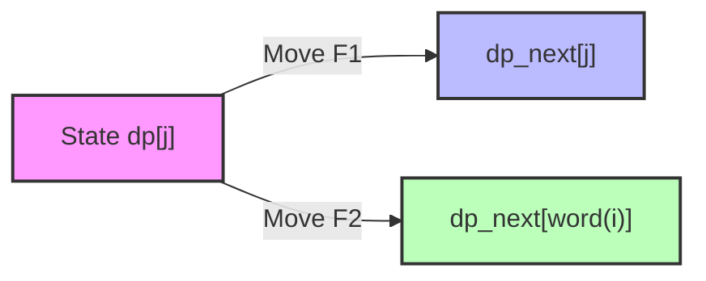

# 🚀 Approach: Optimal Dynamic Programming

## 💡 Key Intuition

The challenge lies in deciding which finger should type the next character to minimize the total travel distance. Since the placement of the "other" finger matters for future moves, we must track the position of both fingers.

### 🗺️ Keyboard Coordinate Mapping
We treat the keyboard as a flat array of 26 letters. The 2D coordinates are derived as:
- **Row:** $r = \text{index} // 6$
- **Column:** $c = \text{index} \% 6$

---

## 🏗️ Algorithm Architecture

We utilize **Dynamic Programming** with state compression (rolling arrays).

### 📐 DP State Definition
Let $dp[j]$ be the minimum distance to type the first $i$ characters of the word where:
1.  **Finger 1** is currently at $word[i-1]$.
2.  **Finger 2** is at character with index $j$ ($0-25$ for 'A'-'Z', or $26$ for "Free/Not placed").

> [!NOTE]
> We don't need to store the position of "Finger 1" in the DP table index because it is always implicitly at the current letter we just typed ($word[i]$).

### 🔄 Transition Logic
When moving from character $word[i]$ to $word[i+1]$:

1.  **Move Finger 1** (The finger at $word[i]$):
    New cost = $dp[j] + \text{dist}(word[i], word[i+1])$
    Other finger stays at $j$.
    
2.  **Move Finger 2** (The finger at $j$):
    New cost = $dp[j] + \text{dist}(j, word[i+1])$
    Other finger stays at $word[i]$.

### Workflow Visualization


---

## 📊 Complexity Profile

| Metric | Complexity | Rationale |
| :--- | :--- | :--- |
| **Time** | $O(N \times \Sigma)$ | $N$ is word length (up to 300), $\Sigma$ is alphabet size (26+1). Total $\sim 8100$ operations. |
| **Space** | $O(\Sigma)$ | Space-optimized rolling array stores only 27 integers at a time. |

---

## 🛠️ Implementation Strategy

1.  **Initialize:** `dp[26] = 0`, all others = $\infty$.
2.  **Iterate:** For each character pair $(curr, target)$ in the word.
3.  **Update:** Compute `next_dp` from `dp` using the transition logic.
4.  **Result:** The answer is the minimum value in the final `dp` table.

```cpp
// Space Optimization Example
vector<int> dp(27, 1e9);
dp[26] = 0; // State: One finger at word[0], other free.
for (int i = 0; i < n - 1; ++i) {
    vector<int> next_dp(27, 1e9);
    // ... update next_dp ...
    dp = move(next_dp);
}
```
