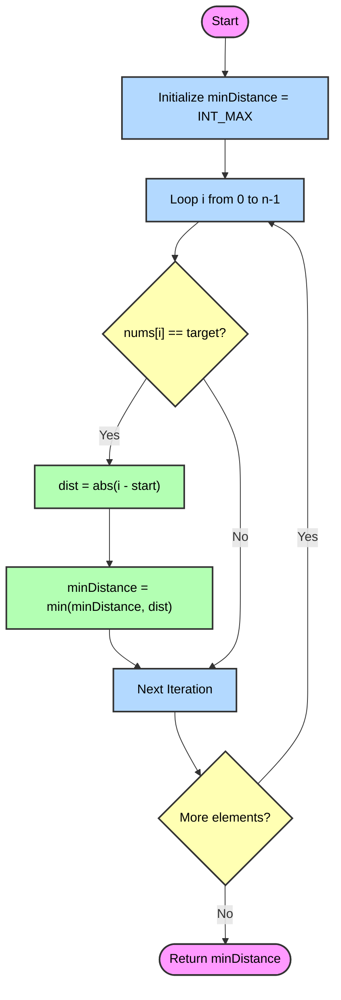

# Minimum Distance to the Target Element

- [Problem Statement](#problem-statement)
- [Linear Search Approach](#linear-search-approach)
    - [Algorithm](#algorithm)
    - [Visual Explanation](#visual-explanation)
    - [Complexity Analysis](#complexity-analysis)
- [Code Implementation](#code-implementation)

---

## 🚀 Linear Search Approach

### 💡 Intuition
The problem asks us to find the minimum absolute difference `abs(i - start)` for an element at index `i` that matches the given `target`. Since the problem constraints specify `1 <= nums.length <= 1000`, a straightforward linear scan to check each element is highly efficient and guaranteed to pass within time limits. 

We simply iterate through the array and whenever we encounter an element equal to `target`, we compute its distance from `start`. We keep track of the minimum distance found so far.

---

### 📝 Algorithm
1. **Initialize:** Start by initializing `minDistance` to a very large number (`INT_MAX`), which will hold our minimum possible distance.
2. **Iterate:** Use a loop to iterate through all elements in the `nums` array with an index `i` (`0` to `n-1`).
3. **Compare:** During each iteration, check if `nums[i] == target`.
4. **Update:** If it matches, calculate the distance `abs(i - start)` and update `minDistance` by taking the minimum of the current `minDistance` and this newly calculated distance.
5. **Return:** After completing the traversal, return the `minDistance` value, which holds the minimized distance.

---

### 👀 Visual Explanation

#### Flowchart



#### Dry Run

Let's dry run the approach using **Example 1**:
`nums = [1, 2, 3, 4, 5]`, `target = 5`, `start = 3`

- Initialize `minDistance = INT_MAX`.

| Index (`i`) | `nums[i]` | Condition: `nums[i] == 5` | Operation / `abs(i - 3)` | Current `minDistance` |
| :---: | :---: | :---: | :--- | :--- |
| `0` | `1` | ❌ False | - | `INT_MAX` |
| `1` | `2` | ❌ False | - | `INT_MAX` |
| `2` | `3` | ❌ False | - | `INT_MAX` |
| `3` | `4` | ❌ False | - | `INT_MAX` |
| `4` | `5` | ✅ True | `abs(4 - 3) = 1` | `min(INT_MAX, 1) = 1` |

- Traversal completes. Best result found is `1`.
- **Return `1`.**

---

### 📊 Complexity Analysis

- **Time Complexity:** $\mathcal{O}(N)$, where $N$ is the number of elements in the array `nums`. We traverse the array exactly once, performing constant time operations in each iteration.
- **Space Complexity:** $\mathcal{O}(1)$, as we only use a few extra variables for computation without needing auxiliary spacing dependent on input size.

---

### 💻 Code Implementation

```cpp
class Solution {
public:
    int getMinDistance(vector<int>& nums, int target, int start) {
        int minDistance = INT_MAX;
        int n = nums.size();
        
        for (int i = 0; i < n; ++i) {
            // Check if current element matches the target
            if (nums[i] == target) {
                // Calculate absolute distance and keep strictly minimum
                minDistance = min(minDistance, abs(i - start));
            }
        }
        
        return minDistance;
    }
};
```
