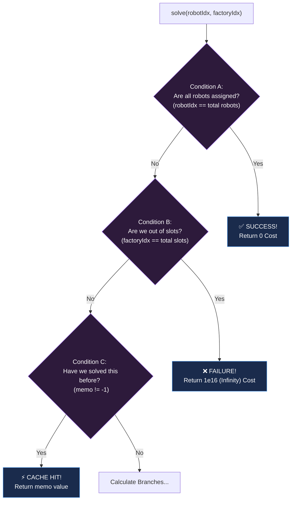

# Approach: Dynamic Programming (Memoization)

## The Core Concept: Flattening the Factories
A factory `[position=2, limit=3]` means there are $3$ parking slots at position $2$. Dealing directly with limits inside recursion gets messy, so we **flatten the limits** to eliminate multi-capacity management. 

Instead of an object `[2, 3]`, we blow it up into a 1D array of individual slots: `[2, 2, 2]`. 
If Example 1 has `factory = [[2, 2], [6, 2]]`, our flattened factory slots look like this:
`Slots Array = [2, 2, 6, 6]`

---

## Visualizing the Code Conditions (Line-by-Line)

In `Solution.cpp`, the DP engine is run entirely through the `solve()` function. Let's visually map out exactly what each logical condition in the code does:

```cpp
long long solve(int robotIdx, int factoryIdx, ...) {
    // Condition A: Success Base Case
    if (robotIdx == robot.size()) return 0;
    
    // Condition B: Failure Base Case
    if (factoryIdx == factorySlots.size()) return 1e16;
    
    // Condition C: Memoization Cache Return
    if (memo[robotIdx][factoryIdx] != -1) return memo[robotIdx][factoryIdx];

    // Branch 1: Skip Slot
    long long skipFactory = solve(robotIdx, factoryIdx + 1, ...);
    
    // Branch 2: Use Slot
    long long useFactory = abs(robot[robotIdx] - factorySlots[factoryIdx]) + solve(robotIdx + 1, factoryIdx + 1, ...);

    // Final Action: Cache & Return min
    return memo[robotIdx][factoryIdx] = min(skipFactory, useFactory);
}
```

### Flowchart of the Conditions



### How the Logic Handles the Math (`min(skipFactory, useFactory)`)
Let's visually trace the math formulas calculated at the bottom of the function.  
Suppose `robot = [4]` and `Slots = [2, 2]`. 

| Step | Current Robot | Current Slot | Branch 1: `skipFactory` Logic | Branch 2: `useFactory` Logic | Condition Result: `min(Skip, Use)` |
| :---: | :---: | :---: | :---: | :---: | :---: |
| 1 | Robot `4` | Slot `2` (1st) | `solve(Rob 4, Slot 2 (2nd))` | `abs(4-2)` + `solve(Rob(none), Slot(none))` | Wait for recursive calls to return... |
| 2 | Robot `4` | Slot `2` (2nd) | `solve(Rob 4, Slot(None))` <br> **Condition B hits!** Returns `1e16` | `abs(4-2)` + `solve(Rob(none), Slot(none))` | Wait for formula evaluation... |
| 3 | (Recursion evaluates base) | | Base case returns `1e16` | | |
| 4 | (Recursion evaluates base) | | | `abs(4-2)` + **Condition A hits (0!)** | |
| 5 | **Evaluate Step 2 state** | | Branch 1 cost evaluates to `1e16` | Branch 2 cost evaluates to `2 + 0 = 2` | `min(1e16, 2) = 2`. Return `2` to Step 1. |
| 6 | **Evaluate Step 1 state** | | Branch 1 cost evaluates to `2` | Branch 2 cost evaluates to `2 + 0 = 2` | `min(2, 2) = 2`. The absolutely minimized distance is **`2`**. |

## Complexity Assessment
- **Time Complexity:** $O(N \times K)$, calculated strictly due to **Condition C**. Without the cache-cutout, the recursive branching would run explosively for thousands of paths computing identically. Caching restricts operations to strictly evaluating every `(Robot, Slot)` state just once. Max limits are very fast operations ($1,000,000$).
- **Space Complexity:** $O(N \times K)$ scaling entirely on the size generated by maintaining the 2D array caching system.
