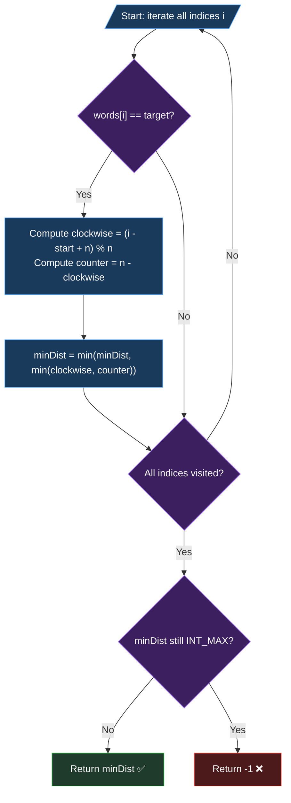

# Approach: Linear Scan with Circular Distance Formula

## 🧠 The Core Concept

For each occurrence of `target` in `words`, we can reach it going either **clockwise** (right) or **counter-clockwise** (left) from `startIndex`. The key insight is:

> In a circular array of size `n`, the two distances between any two indices always **sum to `n`**.

So once we compute the clockwise distance, the counter-clockwise distance is simply `n - clockwise`.

---

## 📐 Distance Formula

For a target found at index `i`, starting from `startIndex`:

```
clockwise  = (i - startIndex + n) % n
counter    = n - clockwise
best       = min(clockwise, counter)
```

The `+ n` in the modulo prevents negative results when `i < startIndex`.

---

## 🔍 Visual Walkthrough

### Example: `words = ["hello","i","am","leetcode","hello"]`, `startIndex = 1`

```
Circular Array (n = 5):
  ┌─────────────────────────────────────────────────────┐
  │  idx: [  0  ] [  1  ] [  2  ] [  3  ] [  4  ]     │
  │ word: [hello] [  i  ] [ am  ] [lcode] [hello]      │
  │               ▲ start                               │
  └─────────────────────────────────────────────────────┘
           ↖ LEFT (counter-clock)     RIGHT (clock) ↗

Target "hello" found at idx 0:
  Clockwise  = (0 - 1 + 5) % 5 = 4
  Counter    = 5 - 4          = 1  ← shorter

Target "hello" found at idx 4:
  Clockwise  = (4 - 1 + 5) % 5 = 3
  Counter    = 5 - 3          = 2

Global min = min(1, 2) = 1 ✅
```

---

## 🔄 Flowchart



---

## 📊 Step-by-Step Trace (Example 2)

`words = ["a","b","leetcode"]`, `target = "leetcode"`, `startIndex = 0`, `n = 3`

| Index `i` | `words[i]` | Match? | Clockwise `(i-0+3)%3` | Counter `3 - cw` | Best |
|:---------:|:----------:|:------:|:---------------------:|:----------------:|:----:|
| 0         | "a"        | ❌     | —                     | —                | —    |
| 1         | "b"        | ❌     | —                     | —                | —    |
| 2         | "leetcode" | ✅     | (2+3)%3 = 2           | 3 - 2 = **1**   | **1** |

**Answer: `1`** ✅

---

## ⏱️ Complexity Assessment

| Metric | Value | Reason |
|--------|-------|--------|
| **Time** | $O(n)$ | Single pass over all `n` words |
| **Space** | $O(1)$ | Only a few integer variables used |

No extra data structures are needed — the circular distance formula handles everything mathematically in-place.
