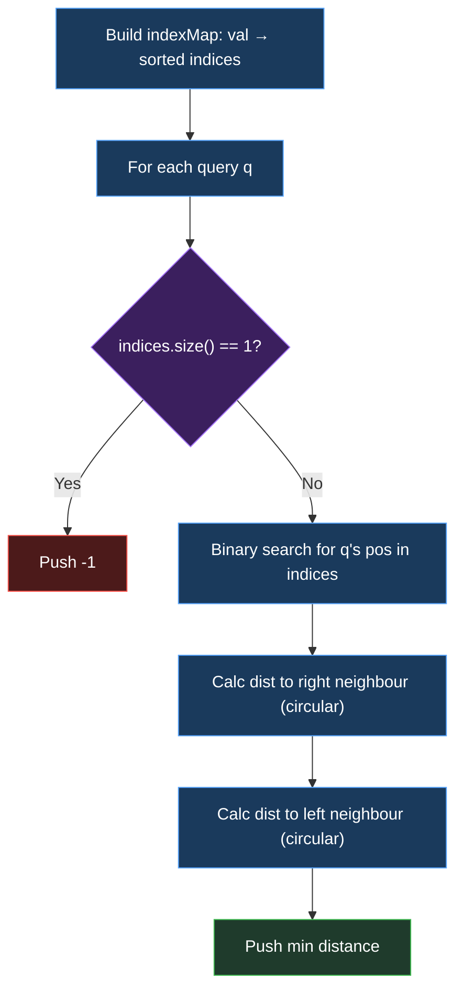

# Approach: Hash Map + Binary Search on Sorted Index Lists

## 🧠 The Core Concept

For each query index `q`, we need the nearest index `j ≠ q` such that `nums[j] == nums[q]`, using **circular distance**.

> **Key Insight:** Pre-group all indices by value. For each query, the closest equal element is guaranteed to be either the **immediate left** or **immediate right** neighbour in that sorted index list — because the list is circular.

---

## 🗺️ Two-Phase Strategy

```
┌───────────────────────────────────────────────────────────┐
│  PHASE 1 │ PREPROCESSING                                  │
│          │ Build a hash map: value → sorted list of       │
│          │ indices where that value appears               │
├───────────────────────────────────────────────────────────┤
│  PHASE 2 │ QUERY ANSWERING                                │
│          │ For each query q:                              │
│          │  1. Look up q's value in map                   │
│          │  2. If only 1 occurrence → answer = -1         │
│          │  3. Binary search for q's position in list     │
│          │  4. Check left & right neighbour distances     │
│          │  5. Return the minimum circular distance       │
└───────────────────────────────────────────────────────────┘
```

---

## 📐 Circular Distance Formula

For two indices `i` and `j` in an array of size `n`:

```
linear_dist  = |i - j|
circular_dist = min(linear_dist,  n - linear_dist)
```

```
  Array of n=7:
  ┌───┬───┬───┬───┬───┬───┬───┐
  │ 0 │ 1 │ 2 │ 3 │ 4 │ 5 │ 6 │
  └───┴───┴───┴───┴───┴───┴───┘
         i=1               j=6
  Linear = |1-6| = 5
  Wrap   = 7 - 5 = 2  ← shorter going left (1→0→6)
```

---

## 🔍 Why Only Check Two Neighbours?

The indices list for a value is **sorted in ascending order**. The nearest index in the circular array must be adjacent in this sorted list (either left or right neighbour, with wrap-around). Checking further neighbours can only give **larger** distances.

```
  Value=1 appears at indices: [0, 2, 4]  (sorted)

  Query q=2, pos=1 in list:
    Left  neighbour → index 0  → dist = min(2, 5) = 2
    Right neighbour → index 4  → dist = min(2, 5) = 2
    Minimum = 2 ✅
```

---

## 💻 Code Implementation (C++)

#### 🗺️ Pipeline at a Glance

```
nums = [1, 3, 1, 4, 1, 3, 2]
         ↓  ↓  ↓  ↓  ↓  ↓  ↓
indexMap:  1 → [0, 2, 4]
           3 → [1, 5]
           4 → [3]
           2 → [6]
```

---

#### 📦 Variables Initialised

```
┌──────────────────────────────────────────────────────┐
│  int n            = nums.size()   ← array length     │
│  unordered_map    indexMap        ← val → [indices]  │
│  vector<int>      answer          ← result array     │
└──────────────────────────────────────────────────────┘
```

---

#### 🔢 Annotated Source Code

```cpp
class Solution {
public:
    vector<int> solveQueries(vector<int>& nums, vector<int>& queries) {

        int n = nums.size();

        // ╔══════════════════════════════════════════════╗
        // ║  PHASE 1 — Group indices by value            ║
        // ╚══════════════════════════════════════════════╝
        //
        //  Walk left-to-right so each list is sorted automatically
        //
        unordered_map<int, vector<int>> indexMap;
        for (int i = 0; i < n; ++i)
            indexMap[nums[i]].push_back(i);   // ← O(n) total

        vector<int> answer;
        answer.reserve(queries.size());

        for (int q : queries) {
            int val     = nums[q];
            auto& indices = indexMap[val];     // ← sorted index list

            // ╔══════════════════════════════════════════════╗
            // ║  PHASE 2a — Unique element check             ║
            // ╚══════════════════════════════════════════════╝
            if (indices.size() == 1) {
                answer.push_back(-1);          // ← no equal neighbour
                continue;
            }

            // ╔══════════════════════════════════════════════╗
            // ║  PHASE 2b — Binary search for q's position   ║
            // ╚══════════════════════════════════════════════╝
            auto it  = lower_bound(indices.begin(), indices.end(), q);
            int  pos = it - indices.begin();   // ← pos of q in list
            int  sz  = indices.size();

            int best = INT_MAX;

            // ╔══════════════════════════════════════════════╗
            // ║  PHASE 2c — Check both adjacent neighbours   ║
            // ╚══════════════════════════════════════════════╝
            //
            //   Right neighbour (with circular list wrap):
            int rightIdx = indices[(pos + 1) % sz];
            int d1 = abs(rightIdx - q);
            best = min(best, min(d1, n - d1));  // ← circular formula

            //   Left neighbour (with circular list wrap):
            int leftIdx = indices[(pos - 1 + sz) % sz];
            int d2 = abs(leftIdx - q);
            best = min(best, min(d2, n - d2));  // ← circular formula

            answer.push_back(best);
        }

        return answer;
    }
};
```

---

## 🔬 Dry-Run: Example 1

`nums = [1,3,1,4,1,3,2]`, `queries = [0,3,5]`, `n = 7`

**After Phase 1 — indexMap:**
```
  1 → [0, 2, 4]
  3 → [1, 5]
  4 → [3]
  2 → [6]
```

**Query-by-Query trace:**

```
Char processed │ Calculation                              │ Answer
───────────────┼──────────────────────────────────────────┼────────
  q=0, val=1  │ indices=[0,2,4], pos=0                   │
               │  Right→ idx[1]=2, d=2, min(2,5)=2        │
               │  Left → idx[2]=4, d=4, min(4,3)=3        │
               │  best = 2                                 │   2 ✅
───────────────┼──────────────────────────────────────────┼────────
  q=3, val=4  │ indices=[3], size=1 → only one occurrence │  -1 ✅
───────────────┼──────────────────────────────────────────┼────────
  q=5, val=3  │ indices=[1,5], pos=1                      │
               │  Right→ idx[0]=1, d=4, min(4,3)=3        │
               │  Left → idx[0]=1, d=4, min(4,3)=3        │
               │  best = 3                                 │   3 ✅
───────────────┴──────────────────────────────────────────┴────────
  Final output │ [2, -1, 3]                               │   ✅
```

---

## 🔄 Flowchart



---

## ⚡ Edge Cases Handled

| Input                         | Expected | Reason                            |
| :---------------------------- | :------- | :-------------------------------- |
| All unique elements           | All `-1` | No duplicates exist               |
| Query on first/last index     | Correct  | Circular wrap handled via `% sz`  |
| Only two occurrences of value | Correct  | Both neighbours point to same idx |
| All same values               | `1`      | Every adjacent is distance 1      |

---

## ⏱️ Complexity Analysis

| Metric | Value | Reason |
|--------|-------|--------|
| **Time**  | $O(n \log n)$ | Building map is $O(n)$; each query does $O(\log k)$ binary search |
| **Space** | $O(n)$        | indexMap stores all `n` indices across all values |
