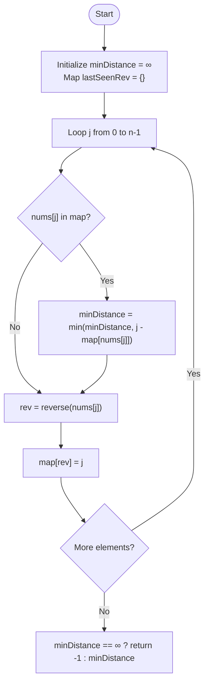

# Minimum Absolute Distance Between Mirror Pairs

---

## 🏷️ Problem Info

| Field         | Details                                                                                              |
| :------------ | :--------------------------------------------------------------------------------------------------- |
| 🌐 Platform   |     |
| 📌 Difficulty |                                      |
| 📂 Topic      | Greedy / Hash Table                                                                                  |
| 🔗 Link       | [Minimum Absolute Distance Between Mirror Pairs](https://leetcode.com/problems/minimum-absolute-distance-between-mirror-pairs/) |
| ⏱️ Avg Time   | 15 minutes                                                                                           |

---

## 📝 Overview

We need to find the minimum distance $|i - j|$ for pairs $(i, j)$ where $i < j$ and $reverse(nums[i]) = nums[j]$.

### Mirror Pair Visualized

```
nums[i] = 120   ─── reverse() ───▶   nums[j] = 21
      ↑                                    ↑
   index i                              index j

Condition: reverse(nums[i]) == nums[j] AND i < j
```

---

## 💡 Approach: Optimized Hash Map Tracking

To find the **minimum distance**, we only care about the **closest** preceding index `i` that satisfies the mirror condition for a current index `j`.

### 🔍 Step-by-Step Algorithm

1. **Initialize** `minDistance = infinity` and an empty hash map `lastSeenRev`.
2. **Iterate** through the array using index `j` from $0$ to $n-1$:
    - Check if `nums[j]` exists in `lastSeenRev`.
    - If it exists, update `minDistance = min(minDistance, j - lastSeenRev[nums[j]])`.
    - Calculate `rev = reverse(nums[j])`.
    - Update `lastSeenRev[rev] = j` (this is the most recent index $i$ that can be matched by a future $nums[k]$).
3. **Return** `-1` if no pairs were found, otherwise return `minDistance`.

---

### 🧠 Control-Flow Diagram



---

### 💻 Code Implementation (C++)

```cpp
class Solution {
public:
    int reverseNumber(int n) {
        long long res = 0;
        while (n > 0) {
            res = res * 10 + (n % 10);
            n /= 10;
        }
        return (int)res;
    }

    int minMirrorPairDistance(vector<int>& nums) {
        int minDistance = INT_MAX;
        unordered_map<int, int> lastSeenRev; 

        for (int j = 0; j < nums.size(); ++j) {
            // Does nums[j] match any reverse(nums[i]) seen so far?
            if (lastSeenRev.count(nums[j])) {
                minDistance = min(minDistance, j - lastSeenRev[nums[j]]);
            }
            
            // Register reverse(nums[j]) for future matches
            int rev = reverseNumber(nums[j]);
            lastSeenRev[rev] = j;
        }
        return (minDistance == INT_MAX) ? -1 : minDistance;
    }
};
```

---

### 📊 Complexity Analysis

| Metric              | Value              | Reason                                                      |
| :------------------ | :----------------- | :---------------------------------------------------------- |
| ⏰ Time Complexity  | $\mathcal{O}(N)$   | One pass through the array. Map operations are $\mathcal{O}(1)$ avg. |
| 💾 Space Complexity | $\mathcal{O}(N)$   | Up to $N$ entries in the hash map.                          |

---

### 🎨 Visual Dry-Run

#### Example: `nums = [12, 21, 45, 33, 54]`

| j | nums[j] | reverse(nums[j]) | Match in Map? | Map Update | minDistance |
|---|---|---|---|---|---|
| 0 | 12 | 21 | No | `21: 0` | ∞ |
| 1 | 21 | 12 | **Yes (0)** | `12: 1` | 1-0 = **1** |
| 2 | 45 | 54 | No | `54: 2` | 1 |
| 3 | 33 | 33 | No* | `33: 3` | 1 |
| 4 | 54 | 45 | **Yes (2)** | `45: 4` | min(1, 4-2) = **1** |

*\*Note: 33 is in the map but as a key to match future nums, not as an existing match at index 3.*
