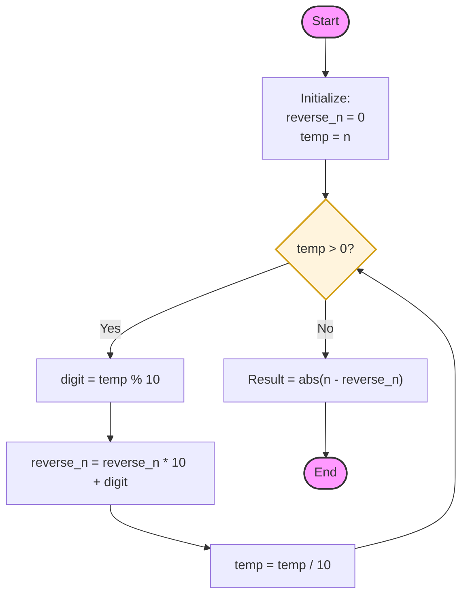

# [3783. Mirror Distance of an Integer - Approach](https://leetcode.com/problems/mirror-distance-of-an-integer/)

---

## 📝 Problem Overview
The **Mirror Distance** of an integer $n$ is defined as the absolute difference between the number and its reverse:
$$\text{Mirror Distance} = |n - \text{reverse}(n)|$$

---

## 💡 Key Intuition
1. **Extraction**: We need to extract digits from the number starting from the unit's place.
2. **Construction**: We build the reversed number by shifting the current reversed sum to the left (multiplying by 10) and adding the extracted digit.
3. **Calculation**: Compute the absolute difference between the original $n$ and the constructed reverse.

---

## 🛠️ Logic Flow


---

## 📊 Visual Walkthrough (n = 25)

| Step | Current temp | Digit Extracted | Formula: `reverse_n * 10 + digit` | New reverse_n |
| :---: | :---: | :---: | :--- | :---: |
| Init | 25 | - | - | 0 |
| 1 | 25 | 5 | `0 * 10 + 5` | 5 |
| 2 | 2 | 2 | `5 * 10 + 2` | 52 |
| Result | 0 | - | `abs(25 - 52)` | **27** |

---

## 🛠️ Code Implementation

```cpp
class Solution {
public:
    int mirrorDistance(int n) {
        long long original_n = n;
        long long reverse_n = 0;
        long long temp = n;

        // Process digits from right to left
        while (temp > 0) {
            reverse_n = reverse_n * 10 + (temp % 10);
            temp /= 10;
        }

        return abs(original_n - reverse_n);
    }
};
```

---

## 📈 Complexity Analysis

| Type | Complexity | Explanation |
| :--- | :--- | :--- |
| **Time Complexity** | $O(\log_{10} N)$ | We iterate through each digit of the number $N$. |
| **Space Complexity** | $O(1)$ | We only use a few variables for calculation. |

---

> [!TIP]
> Using `long long` for the reversed number is a defensive practice to avoid overflow during construction, even though for this specific constraint ($n \le 10^9$) a standard `int` would likely suffice.
