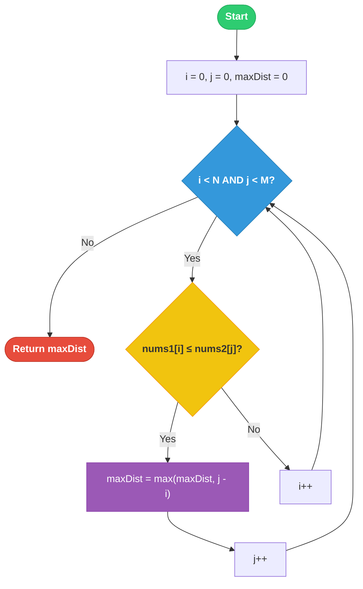

# 🚀 Approach - Maximum Distance Between a Pair of Values

## 💡 Intuition
Given two non-increasing (descending) arrays `nums1` and `nums2`, we need to find the maximum $j - i$ such that $i \le j$ and $nums1[i] \le nums2[j]$.

Since both arrays are sorted in descending order:
1. If $nums1[i] \le nums2[j]$, then for the same $i$, increasing $j$ might still satisfy the condition because $nums2$ decreases. This suggests we can expand the window.
2. If $nums1[i] > nums2[j]$, then $nums2[j]$ is too small for $nums1[i]$. Since $nums2$ only gets smaller as $j$ increases, no $j' > j$ will work for this specific $i$. We must increment $i$.

This monotonic property allows for a highly efficient **Two-Pointer** approach.

---

## 🛠️ Step-by-Step Logic (Two-Pointers)

1.  Initialize two pointers: `i = 0` (for `nums1`) and `j = 0` (for `nums2`).
2.  Initialize `maxDist = 0`.
3.  While `i < nums1.size()` and `j < nums2.size()`:
    -   If `nums1[i] <= nums2[j]`:
        -   If `i <= j`, update `maxDist = max(maxDist, j - i)`.
        -   Increment `j` (try to find a larger distance).
    -   Else:
        -   Increment `i` (looking for a smaller value in `nums1`).
4.  Return `maxDist`.

---

## 📊 Visual Representation

### 🔄 Algorithm Flow


### 🏎️ Dry Run Example
**Input:** `nums1 = [30, 20, 10]`, `nums2 = [40, 30, 20, 10]`

| Step | Pointer `i` | Pointer `j` | `nums1[i]` | `nums2[j]` | Comparison | Action | `maxDist` |
| :--- | :--- | :--- | :--- | :--- | :--- | :--- | :--- |
| 1 | 0 | 0 | 30 | 40 | 30 ≤ 40 (T) | `j++` | 0 |
| 2 | 0 | 1 | 30 | 30 | 30 ≤ 30 (T) | `j++` | 1 |
| 3 | 0 | 2 | 30 | 20 | 30 ≤ 20 (F) | `i++` | 1 |
| 4 | 1 | 2 | 20 | 20 | 20 ≤ 20 (T) | `j++` | 1 |
| 5 | 1 | 3 | 20 | 10 | 20 ≤ 10 (F) | `i++` | 1 |
| 6 | 2 | 3 | 10 | 10 | 10 ≤ 10 (T) | `j++` | 1 |
| 7 | 2 | 4 | - | - | Loop Ends | Return | **1** |

---

## ⏱️ Complexity Analysis

| Type | Complexity | Explanation |
| :--- | :--- | :--- |
| **Time** | $O(N + M)$ | Each pointer `i` and `j` moves from start to end at most once. |
| **Space** | $O(1)$ | No additional data structures used. |

---

## 💻 Implementation snippet

```cpp
int maxDistance(vector<int>& nums1, vector<int>& nums2) {
    int i = 0, j = 0, res = 0;
    while (i < nums1.size() && j < nums2.size()) {
        if (nums1[i] <= nums2[j]) {
            res = max(res, j - i);
            j++;
        } else {
            i++;
        }
    }
    return res;
}
```

---

## 🌟 Key Takeaways
- The **non-increasing** property is crucial. It ensures that if a value in `nums2` is smaller than a value in `nums1`, moving `j` forward will only make it smaller.
- The two-pointer approach is more efficient than binary search ($O(N \log M)$) or brute force ($O(N \cdot M)$).

---
**Source Link:** [LeetCode - Maximum Distance Between a Pair of Values](https://leetcode.com/problems/maximum-distance-between-a-pair-of-values/)

---
