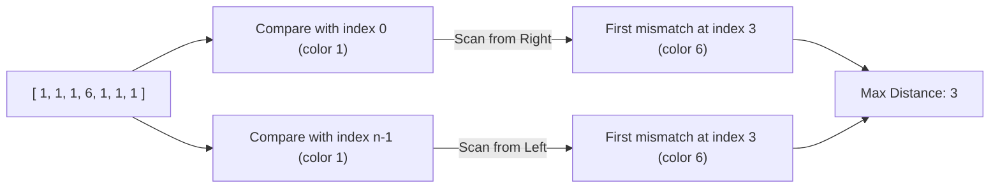

# 🧠 Two Furthest Houses - Premium Approach

## 🌟 Intuition

The goal is to find the maximum distance $|i - j|$ where `colors[i] != colors[j]`. 
Since we want to **maximize** the distance, we should focus on pairs that include the boundaries of the array (index `0` or index `n-1`).

---

## 🛠️ Greedy Strategy

Is it possible that the optimal pair does NOT include either the first or the last house?
**No.** 

Consider any pair $(i, j)$ where $0 < i < j < n - 1$.
- If $colors[i] \ne colors[n-1]$, then $(i, n-1)$ is better because the distance is larger.
- If $colors[i] == colors[n-1]$, then because $colors[i] \ne colors[j]$, we must have $colors[j] \ne colors[n-1]$.
- Similarly, if $(0, j)$ is a valid pair (different colors), it's better than $(i, j)$.

Therefore, we only need to check two scenarios:
1. The furthest house from the **left boundary** (index 0) with a different color.
2. The furthest house from the **right boundary** (index n-1) with a different color.

---

## 📊 Visual Logic



---

## 🚀 Step-by-Step Algorithm

1. **Initialize** `n` as the length of colors.
2. **Scan from Right to Left:** Find the largest index `j` such that `colors[j] != colors[0]`.
3. **Scan from Left to Right:** Find the smallest index `i` such that `colors[i] != colors[n - 1]`.
4. **Result:** Return the maximum of `j` and `(n - 1) - i`.

---

## 💻 Implementation Snippet

```cpp
int maxDistance(vector<int>& colors) {
    int n = colors.size();
    int dist1 = 0, dist2 = 0;

    // Fixed at 0, slide j from right
    for (int j = n - 1; j > 0; j--) {
        if (colors[j] != colors[0]) {
            dist1 = j;
            break;
        }
    }

    // Fixed at n-1, slide i from left
    for (int i = 0; i < n - 1; i++) {
        if (colors[i] != colors[n - 1]) {
            dist2 = (n - 1) - i;
            break;
        }
    }

    return max(dist1, dist2);
}
```

---

## 📈 Performance Profile

| Metric | Complexity | Description |
| :--- | :--- | :--- |
| **Time Complexity** | $O(n)$ | We iterate through the array at most twice. |
| **Space Complexity** | $O(1)$ | No additional data structures used. |
| **Performance** | **Fastest** | Boundary checks are optimal for maximum distance. |

---
**Problem Link:** [Two Furthest Houses With Different Colors](https://leetcode.com/problems/two-furthest-houses-with-different-colors/)
