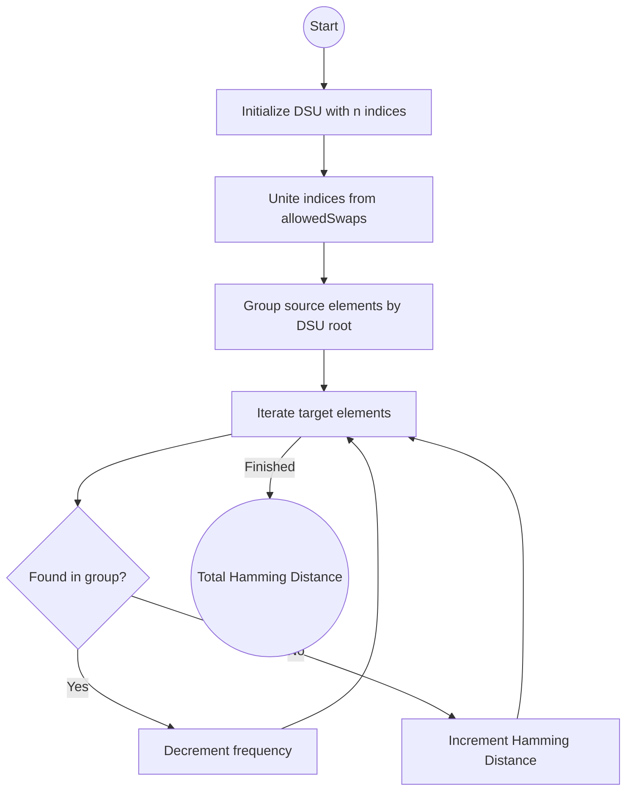

# [Minimize Hamming Distance After Swap Operations - Approach](Solution.cpp)

To solve this problem efficiently, we need to recognize that if indices $i, j$ and $j, k$ are allowed to be swapped, then any element in the set $\{i, j, k\}$ can move to any of these indices. This naturally forms a **Connected Component** in a graph where each swap is an edge.

## Core Idea: Union-Find (DSU)

1.  **Group Indices**: Use **Disjoint Set Union (DSU)** to group all indices together that can be swapped directly or indirectly. Indices in the same set can have their elements rearranged in any permutation.
2.  **Calculate Matches**: For each connected component, find the maximum number of matches between the elements in `source` and the elements in `target` at those specific indices.
3.  **Result**: The minimum Hamming distance for each component is its size minus the number of matches. Summing these up gives the total Hamming distance.

## Algorithm Steps

1.  **Initialize DSU**: Create a DSU structure for $n$ indices ($0$ to $n-1$).
2.  **Unite Components**: For every pair $[a, b]$ in `allowedSwaps`, perform `unite(a, b)`.
3.  **Count Elements by Component**:
    - Iterate through all indices $i$ from $0$ to $n-1$.
    - Find the root of index $i$ using `dsu.find(i)`.
    - Group the values of `source[i]` into a frequency map associated with that root.
4.  **Greedy Matching**:
    - Iterate through all indices $i$ again.
    - For `target[i]`, find if it exists in the frequency map for its component root.
    - If it exists and the count is $>0$, it's a match. Decrement the count.
    - If it's not a match, increment the Hamming distance.

## Logic Flowchart


---
## Solution Code

```cpp
class DSU {
public:
    vector<int> parent;
    DSU(int n) {
        parent.resize(n);
        iota(parent.begin(), parent.end(), 0);
    }
    int find(int i) {
        if (parent[i] == i) return i;
        return parent[i] = find(parent[i]);
    }
    void unite(int i, int j) {
        int root_i = find(i);
        int root_j = find(j);
        if (root_i != root_j) parent[root_i] = root_j;
    }
};

class Solution {
public:
    int minimumHammingDistance(vector<int>& source, vector<int>& target, vector<vector<int>>& allowedSwaps) {
        int n = source.size();
        DSU dsu(n);
        for (auto& s : allowedSwaps) dsu.unite(s[0], s[1]);
        
        unordered_map<int, unordered_map<int, int>> counts;
        for (int i = 0; i < n; ++i) counts[dsu.find(i)][source[i]]++;
        
        int distance = 0;
        for (int i = 0; i < n; ++i) {
            int root = dsu.find(i);
            if (counts[root][target[i]] > 0) counts[root][target[i]]--;
            else distance++;
        }
        return distance;
    }
};
```

## Complexity Analysis

-   **Time Complexity**: $O(N + E \alpha(N) + N \cdot 1)$, where $E$ is the number of swaps and $\alpha$ is the Inverse Ackermann function.
-   **Space Complexity**: $O(N)$ to store the DSU parent array and the frequency maps.

---
**Problem Link:** [Minimize Hamming Distance After Swap Operations](https://leetcode.com/problems/minimize-hamming-distance-after-swap-operations/)
