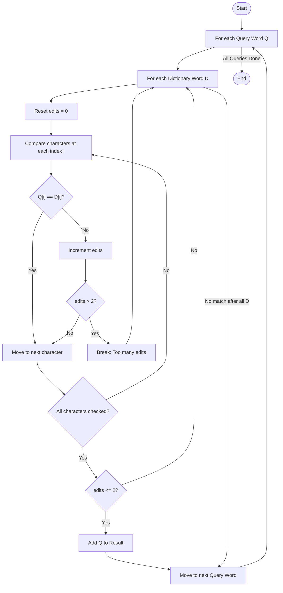

# [2452. Words Within Two Edits of Dictionary](https://leetcode.com/problems/words-within-two-edits-of-dictionary/)

## Solution | Brute Force | Hamming Distance Comparison

### 💡 Intuition
The problem asks us to find which query words can match *any* dictionary word with at most 2 edits. An "edit" is defined as changing one character to another. Since all words have the same length, this is equivalent to finding if the **Hamming Distance** between a query word and any dictionary word is $\le 2$.

Given the constraints:
- $Q$ (queries) $\le 100$
- $D$ (dictionary) $\le 100$
- $N$ (word length) $\le 100$

The total number of operations will be around $100 \times 100 \times 100 = 10^6$, which easily fits within the typical $10^8$ operations per second limit. Thus, a brute-force approach is optimal and straightforward.

---

### 🎨 Visual Explanation

#### How Hamming Distance Works:
We compare characters at the same index in both strings. If they differ, we increment the edit count.

> **Query:** `word` | **Dictionary:** `wood`

| Index | 0 | 1 | 2 | 3 |
| :---: | :-: | :-: | :-: | :-: |
| **Q** | `w` | `o` | `r` | `d` |
| **D** | `w` | `o` | `o` | `d` |
| **Status** | ✅ | ✅ | ❌ | ✅ |

**Total Differences:** `1` (Valid as $1 \le 2$)

---

### 🔄 Workflow Visualization

The following diagram illustrates the decision-making process for each query word, specifically focusing on the **at most 2 edits** condition.



---

### 🗺️ Approach

1.  **Iterate through Queries**: For each word `q` in `queries`, we need to find if it can match any word in the dictionary.
2.  **Iterate through Dictionary**: For the current query `q`, iterate through every word `d` in the `dictionary`.
3.  **Compare Characters**: For a pair of strings `(q, d)`, compare characters at each position $i$ from $0$ to $N-1$.
    - If `q[i] != d[i]`, increment an `edits` counter.
    - **Optimization**: If `edits` becomes greater than 2, stop comparing the current `d` and move to the next dictionary word (early exit).
4.  **Match Found**: If we finish comparing `q` with any `d` and the `edits` counter is $\le 2$, then `q` is a valid word.
    - Add `q` to our result list.
    - **Break**: Move to the next query immediately since we only need to find *one* matching dictionary word.
5.  **Final Result**: After processing all query words, return the collected results in their original order.

---

### 📉 Complexity Analysis

- **Time Complexity:** $O(Q \cdot D \cdot N)$
    - We iterate through $Q$ query words.
    - For each query, we potentially check $D$ dictionary words.
    - For each pair, we compare $N$ characters (word length).
    - In the worst case, we perform $Q \times D \times N$ operations.
    - Given $Q, D, N \le 100$, the operations are $\approx 10^6$, which is well within the $10^8$ per second limit.

- **Space Complexity:** $O(1)$ (Auxiliary)
    - We use a few integer variables (`edits`, `i`) and a boolean flag.
    - The space for the result list is $O(Q \cdot N)$ in the worst case, but this is typically not counted as auxiliary space.

---

### 💻 Solution Code (C++)

```cpp
#include <vector>
#include <string>

using namespace std;

class Solution {
public:
    vector<string> twoEditWords(vector<string>& queries, vector<string>& dictionary) {
        vector<string> result;

        for (const string& query : queries) {
            bool isMatch = false;

            for (const string& word : dictionary) {
                int edits = 0;
                
                for (int i = 0; i < query.length(); ++i) {
                    if (query[i] != word[i]) {
                        edits++;
                    }
                    if (edits > 2) break; // Optimization: Early exit
                }

                if (edits <= 2) {
                    isMatch = true;
                    break; // Match found, move to next query
                }
            }

            if (isMatch) {
                result.push_back(query);
            }
        }
        return result;
    }
};
```

**Problem Link:** [Words Within Two Edits of Dictionary](https://leetcode.com/problems/words-within-two-edits-of-dictionary/description/)
