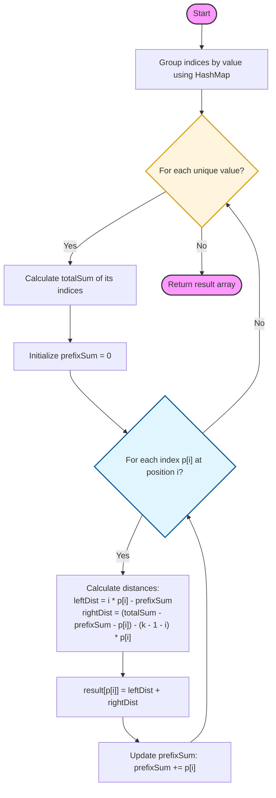

# [Approach - Sum of Distances](Solution.cpp)

## Intuition
The problem asks for the sum of absolute differences between the current index `i` and all other indices `j` where `nums[i] == nums[j]`. 
A naive $O(N^2)$ solution would be to compare every pair, but with $N = 10^5$, we need something more efficient, ideally $O(N)$.

For a specific value, let its indices be $P = [p_0, p_1, p_2, \dots, p_{k-1}]$ in increasing order.
For any index $p_i \in P$, the total distance is:
$$D(p_i) = \sum_{j=0}^{k-1} |p_i - p_j|$$
$$D(p_i) = \sum_{j=0}^{i-1} (p_i - p_j) + \sum_{j=i+1}^{k-1} (p_j - p_i)$$

This can be rewritten using **Prefix Sums**:
$$D(p_i) = \left( i \cdot p_i - \sum_{j=0}^{i-1} p_j \right) + \left( \sum_{j=i+1}^{k-1} p_j - (k - 1 - i) \cdot p_i \right)$$

## Logic Flow



## Visual Representation
Let `nums = [1, 3, 1, 1, 2]`
Indices for `1` are $P = [0, 2, 3]$. Total Sum = 5. $k=3$.

| Index $p_i$ | $i$ | Prefix Sum (incl.) | Left Dist ($i \cdot p_i - \text{pre}$) | Right Dist ($\text{suf} - (k-1-i) \cdot p_i$) | Total |
| :--- | :--- | :--- | :--- | :--- | :--- |
| **0** | 0 | 0 | $0 \cdot 0 - 0 = 0$ | $(5-0) - 2 \cdot 0 = 5$ | **5** |
| **2** | 1 | 2 | $1 \cdot 2 - 0 = 2$ | $(5-2) - 1 \cdot 2 = 1$ | **3** |
| **3** | 2 | 5 | $2 \cdot 3 - 2 = 4$ | $(5-5) - 0 \cdot 3 = 0$ | **4** |

## Implementation

```cpp
#include <vector>
#include <unordered_map>
using namespace std;

class Solution {
public:
    vector<long long> distance(vector<int>& nums) {
        int n = nums.size();
        vector<long long> result(n, 0);
        unordered_map<int, vector<int>> indices;

        for (int i = 0; i < n; ++i) indices[nums[i]].push_back(i);

        for (auto& [val, p] : indices) {
            int k = p.size();
            if (k <= 1) continue;

            long long totalSum = 0;
            for (int idx : p) totalSum += idx;

            long long prefixSum = 0;
            for (int i = 0; i < k; ++i) {
                long long currentIdx = p[i];
                prefixSum += currentIdx;
                
                long long left = i * currentIdx - (prefixSum - currentIdx);
                long long right = (totalSum - prefixSum) - (long long)(k - 1 - i) * currentIdx;
                
                result[currentIdx] = left + right;
            }
        }
        return result;
    }
};
```

## Test Harness (Main.cpp)

A driver script to validate the solution against multiple test scenarios.

```cpp
#include <iostream>
#include <vector>
#include "Solution.cpp"

void runTest(std::vector<int> nums) {
    Solution sol;
    std::vector<long long> result = sol.distance(nums);
    std::cout << "Input: ";
    for(int x : nums) std::cout << x << " ";
    std::cout << "\nResult: ";
    for(long long x : result) std::cout << x << " ";
    std::cout << "\n-------------------" << std::endl;
}

int main() {
    runTest({1, 3, 1, 1, 2});
    runTest({0, 5, 3});
    return 0;
}
```

## Complexity Analysis

- **Time Complexity:** $O(n)$, where $n$ is the length of `nums`. We traverse the array once to group indices and then iterate through the total number of indices across all groups.
- **Space Complexity:** $O(n)$, to store the `indices` map and the `result` vector.

---
### Key Highlights
- **Math Trick:** Breaking the absolute difference into prefix and suffix sums allows $O(1)$ calculation per index.
- **Data Types:** `long long` is essential as sums of indices can reach $\approx 10^{10}$ ($10^5 \times 10^5$).
- **Efficiency:** Single pass grouping + Single pass processing per group.

---
**Difficulty:** Medium  
**Topics:** Array, Hash Table, Prefix Sum  
**Problem Link:** [2615. Sum of Distances](https://leetcode.com/problems/sum-of-distances/)