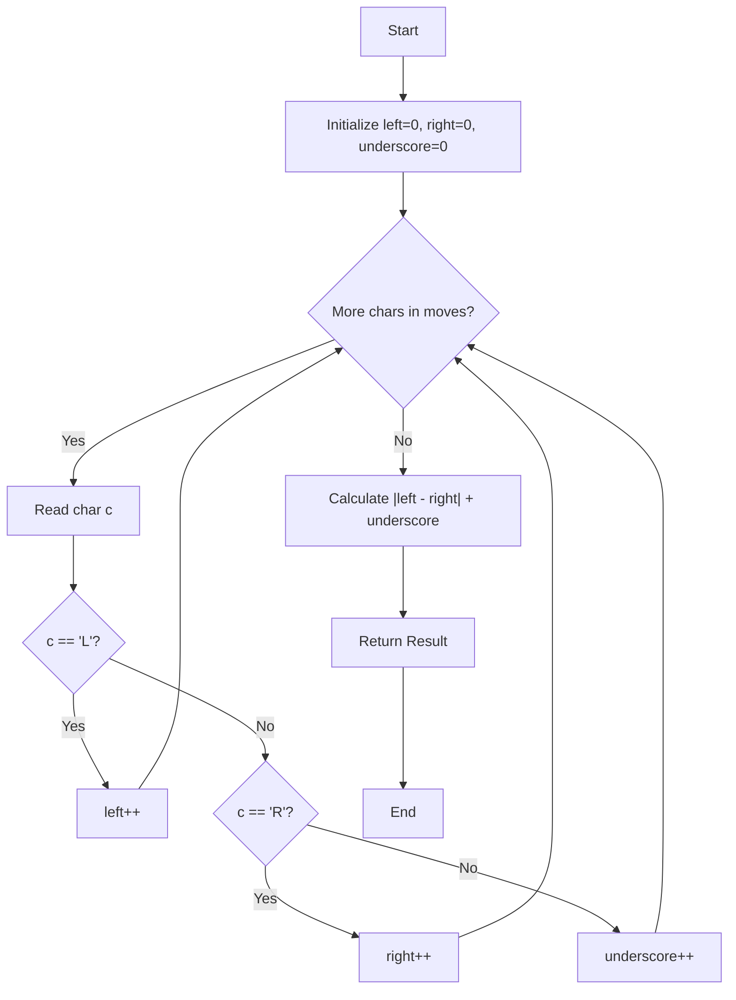

# Approach - Furthest Point From Origin

## Problem Intuition
We want to maximize our absolute distance from the origin on a 1D number line. We can move left (`L`), right (`R`), or choose a direction if there's an underscore (`_`).
To reach the furthest point, we should assign all underscores (`_`) to the direction that we are already leaning towards. That is, if there are more `R`s than `L`s, making all underscores `R`s pushes us further to the right. Conversely, if there are more `L`s, making all underscores `L`s pushes us further to the left.

The final distance formula effectively becomes: 
`Distance = |Count of L - Count of R| + Count of _`

---

## 🛠️ Algorithm Logic

1.  **Initialize Variables**:
    *   `left_count` = 0
    *   `right_count` = 0
    *   `underscore_count` = 0
2.  **Iterate and Count**:
    *   Loop through each character `move` in the `moves` string.
    *   If `move == 'L'`, increment `left_count`.
    *   If `move == 'R'`, increment `right_count`.
    *   If `move == '_'`, increment `underscore_count`.
3.  **Calculate Final Distance**:
    *   Calculate the absolute difference between fixed directions: `abs(left_count - right_count)`.
    *   Add the flexible directions: `+ underscore_count`.
4.  **Return** the computed result.

---

## 📊 Visual Flow (Mermaid Diagram)



---

## 📈 Step-by-Step Example
**Input**: `moves = "L_RL__R"`

| Move | `L` count | `R` count | `_` count |
| :--- | :--- | :--- | :--- |
| `L` | 1 | 0 | 0 |
| `_` | 1 | 0 | 1 |
| `R` | 1 | 1 | 1 |
| `L` | 2 | 1 | 1 |
| `_` | 2 | 1 | 2 |
| `_` | 2 | 1 | 3 |
| `R` | 2 | 2 | 3 |

**End of Loop**: 
- `left_count = 2`
- `right_count = 2`
- `underscore_count = 3`

**Result**: `|2 - 2| + 3 = 0 + 3 = 3`

---

## 💻 Implementation (C++)

```cpp
class Solution {
public:
    int furthestDistanceFromOrigin(string moves) {
        int left_count = 0;
        int right_count = 0;
        int underscore_count = 0;

        for (char move : moves) {
            if (move == 'L') {
                left_count++;
            } else if (move == 'R') {
                right_count++;
            } else {
                underscore_count++;
            }
        }

        return abs(left_count - right_count) + underscore_count;
    }
};
```

---

## ⏳ Complexity Analysis

*   **Time Complexity**: $O(N)$ where $N$ is the length of the string. We iterate through the string exactly once.
*   **Space Complexity**: $O(1)$ since we only need three integers for counting, regardless of the size of the input string.

---

## 📁 Project Files
- [Problem Statement](Problem.md)
- [Solution Implementation](Solution.cpp)
- [Main / Driver Code](Main.cpp)
