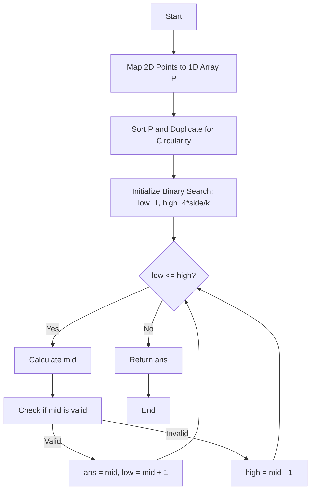

# [Approach - Maximize the Distance Between Points on a Square](Solution.cpp)

## 💡 Problem Intuition

The problem requires us to pick $k$ points from the boundary of a square to maximize the minimum Manhattan distance between any pair.

**Crucial Observation:**
For any two points lying on the boundary of a rectangle/square, the minimum Manhattan distance between them is equal to the shortest distance along the boundary itself. Because we are choosing $k \ge 4$ points, the cyclic adjacent perimeter segments will average out to $4 \times \text{side} / k \le \text{side}$. This implies that the pair dominating the minimum distance will strictly be on the same or adjacent edge, where their Manhattan distance is perfectly equivalent to their 1D boundary distance!

This reduces the problem to **Aggressive Cows on a Circle**:
1. Flatten the 2D boundary coordinates into a 1D cyclic array of lengths from $[0, 4 \times \text{side})$.
2. Duplicate the array `P[i] -> P[i] + 4*side` to easily handle the circular nature of the square boundary.
3. Use **Binary Search on the Answer**.

---

## 🛠️ Algorithm Logic

1. **Mapping 2D to 1D**:
   - `Bottom Edge (y = 0)`: maps to $x$
   - `Right Edge (x = side)`: maps to $\text{side} + y$
   - `Top Edge (y = side)`: maps to $2 \times \text{side} + (\text{side} - x)$
   - `Left Edge (x = 0)`: maps to $3 \times \text{side} + (\text{side} - y)$

2. **Binary Search**:
   - The minimum distance $M$ can range from $1$ to $\text{Perimeter} / k$.
   - For a fixed `mid`, check if we can place $k$ points with at least `mid` distance between any two adjacent ones.

3. **Greedy Check Function in $\mathcal{O}(N \cdot k)$**:
   - Build a `next_jump` array using the two-pointer technique to identify the very next valid point efficiently.
   - For every possible starting point $i$, take $k-1$ jumps greedily. 
   - If the final jump distance from the start point is $\le \text{Perimeter} - mid$, it means the loop wraps around successfully, leaving at least `mid` distance from the last point to the first!

---

## 📊 Visual Flow (Mermaid Diagram)



---

## 💻 Implementation (C++)

```cpp
#include <iostream>
#include <vector>
#include <algorithm>

using namespace std;

class Solution {
private:
    long long mapTo1D(int x, int y, int side) {
        if (y == 0) return x;                                // Bottom edge
        if (x == side) return (long long)side + y;           // Right edge
        if (y == side) return 2LL * side + (side - x);       // Top edge
        if (x == 0) return 3LL * side + (side - y);          // Left edge
        return 0; 
    }

    bool check(long long mid, int k, int N, const vector<long long>& extended_P, long long perimeter) {
        vector<int> next_jump(2 * N, 2 * N);
        int j = 0;
        
        // Two pointers to find the next valid point greedy jump
        for (int i = 0; i < 2 * N; ++i) {
            while (j < 2 * N && extended_P[j] - extended_P[i] < mid) {
                j++;
            }
            next_jump[i] = j;
        }
        
        // Check if there is a valid starting point
        for (int i = 0; i < N; ++i) {
            int current = i;
            int count = 1;
            
            // Greedily take k-1 jumps
            while (count < k && current < 2 * N) {
                current = next_jump[current];
                count++;
            }
            
            // Validate if the k points fit strictly within the cyclic perimeter
            if (count == k && current < 2 * N) {
                if (extended_P[current] - extended_P[i] <= perimeter - mid) {
                    return true;
                }
            }
        }
        return false;
    }

public:
    int maxDistance(int side, vector<vector<int>>& points, int k) {
        int N = points.size();
        vector<long long> P(N);
        
        // Map all 2D points to 1D cyclic distances
        for (int i = 0; i < N; ++i) {
            P[i] = mapTo1D(points[i][0], points[i][1], side);
        }
        
        // Sort the points to process them in cyclic order
        sort(P.begin(), P.end());
        
        long long perimeter = 4LL * side;
        vector<long long> extended_P(2 * N);
        
        // Duplicate the array to simulate the circular boundary
        for (int i = 0; i < N; ++i) {
            extended_P[i] = P[i];
            extended_P[i + N] = P[i] + perimeter;
        }
        
        // Binary search for the maximum possible minimum distance
        long long low = 1, high = perimeter / k;
        int ans = 0;
        
        while (low <= high) {
            long long mid = low + (high - low) / 2;
            
            if (check(mid, k, N, extended_P, perimeter)) {
                ans = mid;
                low = mid + 1;  // Try to find a larger distance
            } else {
                high = mid - 1; // Current distance too large
            }
        }
        
        return ans;
    }
};
```

---

## ⏳ Complexity Analysis

* **Time Complexity**: $\mathcal{O}\big(N \log N + \log(\frac{4S}{k}) \cdot (N \cdot k)\big)$
  - Sorting takes $\mathcal{O}(N \log N)$.
  - Binary search takes $\log(4S) \approx 32$ iterations.
  - The check function takes $\mathcal{O}(N)$ for two pointers and $\mathcal{O}(N \cdot k)$ for validation.
  - Due to $k \le 25$, the overall time is incredibly fast and easily passes the 1-second limit.
* **Space Complexity**: $\mathcal{O}(N)$ to store the mapped, sorted, and duplicated 1D arrays (`extended_P`).

---

## 📁 Project Files
- [Problem Statement](Problem.md)
- [Solution Implementation](Solution.cpp)
- [Main / Driver Code](Main.cpp)
