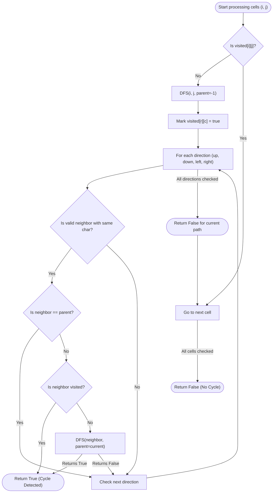

# Approach: Depth First Search (DFS) for Cycle Detection

---

## Intuition
The grid can be visualized as an undirected graph where each cell is a node, and edges connect adjacent cells that have the same character. Detecting a cycle in an undirected graph can be efficiently done using Depth First Search (DFS). If during our traversal, we encounter a node that has already been visited and it is not the node we just came from (the parent), it indicates the presence of a cycle.

## Algorithm:
1. Initialize a `visited` boolean matrix of the same size as the `grid` to keep track of visited cells.
2. Iterate through every cell `(i, j)` in the grid.
3. If the cell `(i, j)` has not been visited, start a DFS traversal from it.
4. In the DFS function:
   - Mark the current cell as `visited`.
   - Explore all 4 valid adjacent directions (up, down, left, right).
   - If the adjacent cell has the same character and is within bounds:
     - If the adjacent cell is the parent (the cell we just came from), ignore it to prevent trivial 2-node cycles.
     - If the adjacent cell is already `visited`, a valid cycle is detected; return `true`.
     - Otherwise, recursively call DFS for the adjacent cell.
5. If any DFS call returns `true`, propagate `true` to the main function and return it.
6. If all cells are processed without finding a cycle, return `false`.

## Time and Space Complexity:
- **Time Complexity:** $\mathcal{O}(m \times n)$ where $m$ is the number of rows and $n$ is the number of columns. In the worst case, each cell is visited exactly once during the DFS traversal.
- **Space Complexity:** $\mathcal{O}(m \times n)$ for the `visited` array and the implicit call stack due to recursion in the worst-case scenario where the entire grid forms one continuous path.

## Visual Workflow:

---
### Navigation:
- [Approach](Approach.md)
- [Solution](Solution.cpp)
- [Driver Code](Main.cpp)

---