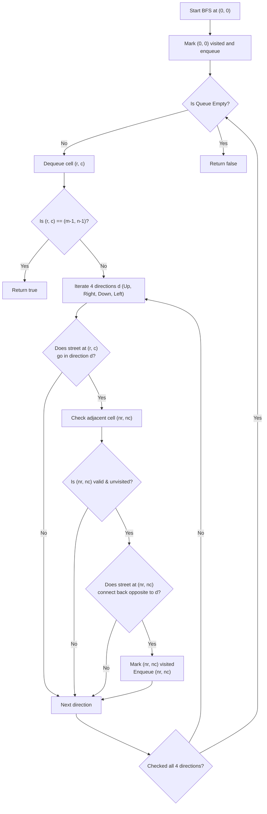

# Check if There is a Valid Path in a Grid - Approach

## Problem Overview
We are given an $M \times N$ grid where each cell represents a type of street. The streets allow movement in specific directions (up, down, left, right). We need to determine if there's a valid path starting from the top-left cell `(0, 0)` and reaching the bottom-right cell `(m-1, n-1)`. A path is valid if we can traverse from one cell to an adjacent one, meaning the streets must connect correctly.

## Approach: Breadth-First Search (BFS) / Graph Traversal
The problem can be modeled as finding a path in a graph where grid cells are nodes and valid street connections are edges. Since we just need to verify reachability from the source to the destination, Breadth-First Search (BFS) is highly efficient.

### Encoding the Street Types
Each street type `1` through `6` can be represented by a boolean array or bitmask of length 4, corresponding to the 4 cardinal directions: `Up (0)`, `Right (1)`, `Down (2)`, `Left (3)`.
- **1**: `[False, True, False, True]` (Right, Left)
- **2**: `[True, False, True, False]` (Up, Down)
- **3**: `[False, False, True, True]` (Down, Left)
- **4**: `[False, True, True, False]` (Down, Right)
- **5**: `[True, False, False, True]` (Up, Left)
- **6**: `[True, True, False, False]` (Up, Right)

### Algorithm Steps
1. **Initialize a Queue:** Start a BFS queue with the initial cell `(0, 0)`. Mark `(0, 0)` as visited.
2. **Process Cells:** While the queue is not empty:
   - Dequeue the front cell `(r, c)`.
   - If `(r, c)` is the destination `(m-1, n-1)`, return `true`.
   - Check all 4 directions from `(r, c)`.
   - If the street at `(r, c)` allows movement in a direction `d`, compute the adjacent coordinates `(nr, nc)`.
   - Verify `(nr, nc)` is within bounds and not yet visited.
   - **Crucial Check:** Verify that the adjacent cell `(nr, nc)` has a street that connects *back* in the opposite direction `(d + 2) % 4`.
   - If valid, mark `(nr, nc)` as visited and push to the queue.
3. **Completion:** If the queue empties without reaching `(m-1, n-1)`, return `false`.

### Complexity Analysis
- **Time Complexity:** $\mathcal{O}(M \times N)$, where $M$ is the number of rows and $N$ is the number of columns. In the worst case, we visit every cell once.
- **Space Complexity:** $\mathcal{O}(M \times N)$ for the `visited` array and the BFS queue.

## Visual Diagram
Below is a Mermaid flowchart illustrating the BFS decision process. (Note: Node strings are quoted to prevent syntax parsing errors).

## Links
- [Problem](./Problem.md)
- [Solution](./Solution.cpp)
- [Main](./main.cpp)
