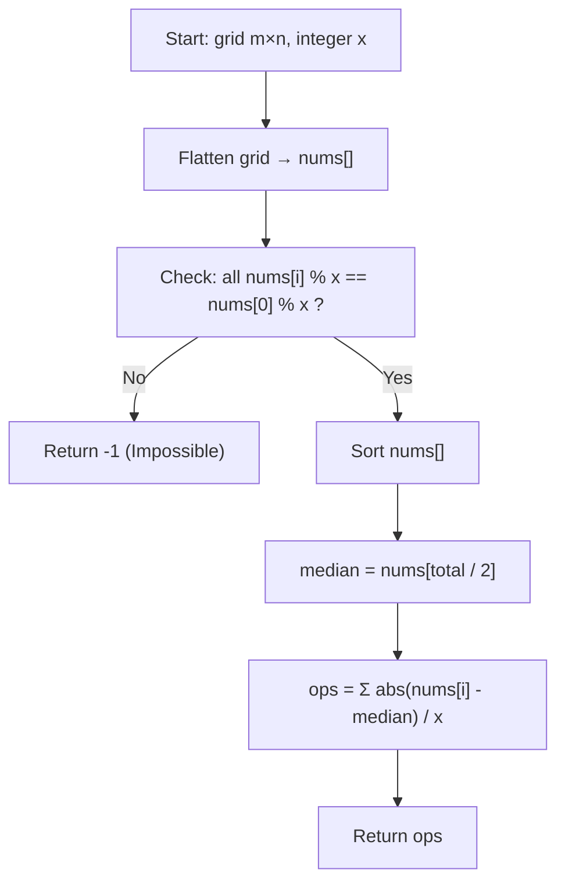

# Approach — Minimum Operations to Make a Uni-Value Grid

<div align="center">
  
  
  
</div>

---

## Key Observations

1. **Feasibility Check**: Any element can only be reached if every element has the **same remainder when divided by `x`**.  
   - If `grid[i][j] % x` is not the same for all cells → return `-1`.

2. **Optimal Target Value**: To minimise the total number of operations (= total absolute difference / x), we need to find the value that minimises `Σ |v - target|`.  
   - By a classical mathematical property, this optimal value is the **median** of the flattened, sorted array.

3. **Count Operations**: For each element `v`, the cost is `|v - median| / x` (always an integer because of step 1).

---

## Step-by-Step Algorithm

| Step | Action |
|------|--------|
| 1 | Flatten the 2D grid into a 1D array `nums`. |
| 2 | Check that all values have the **same remainder `% x`**; if not, return `-1`. |
| 3 | **Sort** `nums`. |
| 4 | Pick `median = nums[n/2]` (index-based median). |
| 5 | Accumulate `abs(v - median) / x` for each element. |
| 6 | Return the total operations count. |

---

## Visualization



---

## Why Median Works

The **median** minimises the sum of absolute deviations — a well-known result from statistics.

- For a **sorted** array of size N, picking `nums[N/2]` is always optimal.
- Choosing the mean would minimise squared differences (MSE), not absolute differences (MAE).

---

## Worked Example

**Input:** `grid = [[2,4],[6,8]], x = 2`

```
Flatten  → [2, 4, 6, 8]
rem % x  → all even ✓
Sort     → [2, 4, 6, 8]
Median   → nums[2] = 6  (or nums[1]=4 also works — both give 4 total ops)
Ops      → |2-4|/2 + |4-4|/2 + |6-4|/2 + |8-4|/2
         =   1   +   0   +   1   +   2   = 4  ✓
```

---

## Complexity Analysis

| Metric | Value | Reason |
|--------|-------|--------|
| **Time** | `O(m·n · log(m·n))` | Dominated by the sort step |
| **Space** | `O(m·n)` | Flattened array storage |

---

## Related Files

- [Problem Statement](Problem.md)
- [C++ Solution](Solution.cpp)
- [Test Driver](Main.cpp)
