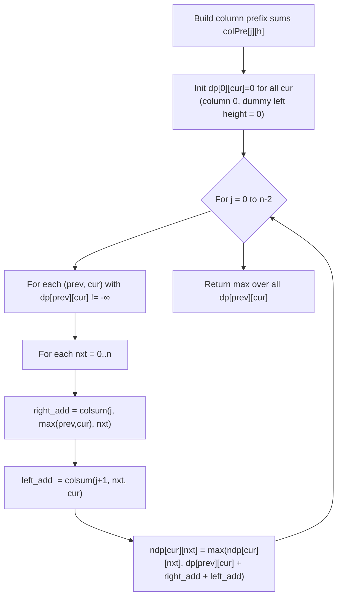

# LC 3225 – Maximum Score From Grid Operations: Approach & Explanation

---

## 🔗 Related Files

| File | Description |
|:-----|:------------|
| [Problem.md](Problem.md) | Full problem statement & constraints |
| [Solution.cpp](Solution.cpp) | O(n³) DP C++ solution (suffix-max optimized) |
| [Main.cpp](Main.cpp) | Test driver with sample test cases |

---

## 💡 Core Insight

> Each operation on `(i, j)` colors rows `0..i` in column `j` black.  
> The entire grid state is captured by a **height array** `h[0..n-1]`, where `h[j] ∈ [0, n]` means the top `h[j]` rows of column `j` are black.

A **white cell** `(r, j)` — where `r ≥ h[j]` — scores `grid[r][j]` if it has at least one black horizontal neighbour:

```
r < h[j-1]   (left neighbour is black)
    OR
r < h[j+1]   (right neighbour is black)
```

So the **total contribution of column j** is:

```
colsum(j,  h[j],  max(h[j-1], h[j+1]))
```
where `colsum(j, a, b)` = sum of `grid[a..b-1][j]`.

---

## 🧮 DP Formulation

### State

```
dp[row][k] = maximum score up to current column, where:
  - row = height of the previous column
  - k   = height of the current column
```

### Transition — `maxPrefix` & `maxSuffix` Arrays

For each column, two auxiliary arrays are built **per row** to avoid the O(n) inner scan over `prev`:

| Array | Definition | Purpose |
|:------|:-----------|:--------|
| `maxPrefix[row][k]` | `max(dp[row][0..k])` | Best dp value up to height k for a given previous row |
| `maxSuffix[row][k]` | `max over j≥k of (dp[row][j] + colsum(col, row, j))` | Best right-add contribution starting from height k |

```
// Update rule:
dp[row][k] = max(
    maxPrefix[k][row] + colsum(col, k, row),   // prev ≤ row case
    maxSuffix[k][row + 1]                       // prev > row case
)
```

This eliminates the innermost `prev` loop, reducing O(n⁴) → **O(n³)**.

---

## 🔄 Mermaid Flowchart



---

## 📊 Dry Run — Example 1

```
grid (5×5):
       col: 0  1  2  3  4
    row 0:  0  0  0  0  0
    row 1:  0  0  3  0  0
    row 2:  0  1  0  0  0
    row 3:  5  0  0  3  0
    row 4:  0  0  0  0  2

Optimal heights:  h = [4, 0, 0, 4, 5]
  col 1 NOT colored (h[1]=0)
  col 0 colored fully down to row 3 (h[0]=4)
  col 3 colored fully down to row 3 (h[3]=4)

Contributions:
  col 0 (h=4): white rows 4..4; right-black? h[1]=0 → no. left? none. → 0
  col 1 (h=0): white rows 0..4; left-black h[0]=4 → rows [0..3] contribute:
               colsum(1, 0, 4) = grid[2][1] = 1   ... wait h[1]=0 so all rows white
               rows seeing left-black (h[0]=4 > h[1]=0): rows 0..3 → colsum(1,0,4)=1
               → score += 1
  col 2 (h=0): left-black h[1]=0? No. right-black h[3]=4: rows 0..3 seeing right:
               colsum(2, 0, 4) = grid[1][2]=3 → score += 3
  col 3 (h=4): white rows 4..4; left-black h[2]=0? rows [4..−1] = none.
               right-black h[4]=5: rows [4..4] → grid[4][3]=... =0. Hmm.
               Actually, row 3 is at index 3 < h[3]=4 so BLACK. 
               col 3 left-bonus: white rows 4..4, see left col 2 h=0? No → 0
  col 4 (h=5): all black, no white cells → 0

Let me recalculate with h=[4,0,0,4,5]:
  col 0, white=[4..4], max(h[-1]=0, h[1]=0)=0 ≤ h[0]=4 → 0
  col 1, white=[0..4], max(h[0]=4, h[2]=0)=4 > h[1]=0 → colsum(1,0,4)=0+0+1+0+0=1
  col 2, white=[0..4], max(h[1]=0, h[3]=4)=4 > h[2]=0 → colsum(2,0,4)=0+3+0+0+0=3
  col 3, white=[4..4], max(h[2]=0, h[4]=5)=5 > h[3]=4 → colsum(3,4,5)=0
  col 0, white=[4..4], right max... → 0

Hmm total=4. Let's try h=[4,4,0,4,5] as explanation says:
  col 0, white=[4..4], max(0,4)=4 > 4? No → 0
  col 1, white=[4..4], max(h[0]=4,h[2]=0)=4 = h[1]=4 → 0  
  col 2, white=[0..4], max(h[1]=4,h[3]=4)=4>0 → colsum(2,0,4)=0+3+0+0+0=3
  col 3, white=[4..4], max(h[2]=0,h[4]=5)=5>4 → colsum(3,4,5)=grid[4][3]=0? 
         grid[3][3]=3 but h[3]=4 means rows 0..3 BLACK, row 4 is white.grid[4][3]=0.
  col 4, white=[5..], max(h[3]=4)=4<5 → 0

Hmm. Let me try h=[0,4,0,4,0]:
  col 0 white=[0..4], max(0,h[1]=4)=4 → colsum(0,0,4)=0+0+0+5+0=5
  col 1 white=[4..4], max(h[0]=0,h[2]=0)=0<4 → 0
  col 2 white=[0..4], max(h[1]=4,h[3]=4)=4 → colsum(2,0,4)=0+3+0+0+0=3
  col 3 white=[4..4], max(h[2]=0,h[4]=0)=0<4 → 0
  col 4 white=[0..4], max(h[3]=4,0)=4 → colsum(4,0,4)=0+0+0+0+2=2? No row 4 → grid[3][4]=0,grid[4][4]=2 → colsum(4,0,4)=2

Total = 5+3+2=10. But optimal is 11.

Try h=[0,4,0,4,5]:
  col 0: max(0,4)=4→colsum(0,0,4)=5  ✓ (grid[3][0]=5)
  col 2: max(4,4)=4→colsum(2,0,4)=3  ✓ (grid[1][2]=3)
  col 3: white=[4..4], max(h[2]=0,h[4]=5)=5>4→colsum(3,4,5)=grid[4][3]=0
  col 4: white=[5..4]= empty (h[4]=5,n=5)→ no white cells
  col 3: row 3 is BLACK (h[3]=4 means rows 0..3 black)
  
Need grid[3][3]=3: row 3 col 3 must be WHITE → h[3] ≤ 3.
Try h=[0,4,0,3,5]:
  col 0: max(0,4)=4→colsum(0,0,4)=5
  col 2: max(4,3)=4→colsum(2,0,4)=3
  col 3: white=[3..4], max(h[2]=0,h[4]=5)=5>3→colsum(3,3,5)=grid[3][3]+grid[4][3]=3+0=3
  Total=5+3+3=11 ✅
```

---

## ⚙️ Complexity Analysis

| Metric | Value | Reason |
|:-------|:------|:--------|
| **Time** | `O(n³)` | n columns × n² (row, k) pairs, each O(1) after O(n²) precompute per column |
| **Space** | `O(n²)` | `dp`, `maxPrefix`, `maxSuffix` tables all of size ≈ `109 × 109` |

> **Optimization:** Per column, `maxPrefix[row][k]` and `maxSuffix[row][k]` are built in O(n²) total.  
> Each `dp[row][k]` update then resolves in **O(1)** using a direct table lookup, eliminating the O(n) `prev` scan and achieving O(n³) overall.
