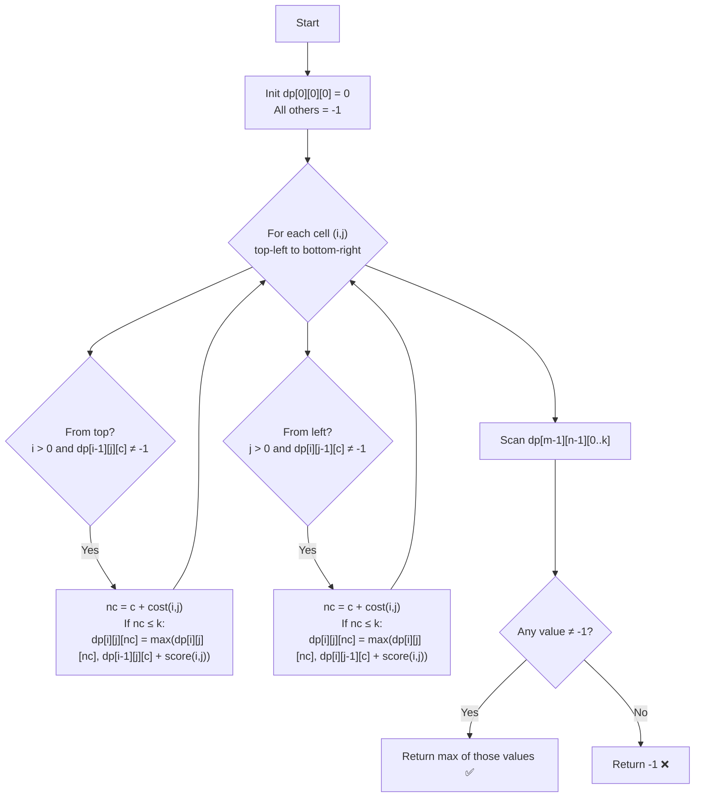

# LeetCode 3742 – Maximum Path Score in a Grid: Approach & Explanation

---

## 🔗 Related Files

| File | Description |
|:-----|:------------|
| [Problem.md](Problem.md) | Full problem statement & constraints |
| [Solution.cpp](Solution.cpp) | O(m·n·k) 3-D DP C++ solution |
| [Main.cpp](Main.cpp) | Test driver with 5 sample test cases |

---

## 💡 Core Intuition

> **Key Insight:** We traverse the grid from `(0,0)` to `(m-1, n-1)` moving only right or down.  
> We track **both score and cost** simultaneously. Since cost ≤ `k ≤ 1000`, we can add cost as a third DP dimension.
>
> `dp[i][j][c]` = **maximum score** reachable at cell `(i, j)` having spent exactly `c` total cost.

---

## 🗂️ Cell Value Lookup Table

| Value | Score | Cost |
|:-----:|:-----:|:----:|
| `0` | 0 | 0 |
| `1` | +1 | 1 |
| `2` | +2 | 1 |

> Note: both `1` and `2` cost exactly **1** to enter; they differ only in **score**.

---

## 🧮 DP Formulation

### State

```
dp[i][j][c]  =  maximum score at cell (i,j) using exactly cost c
```

### Base Case

```
dp[0][0][0] = 0        (start at top-left; value 0 → score 0, cost 0)
All other states      = -1  (unreachable)
```

### Transition

When entering cell `(i, j)` from:
- **Top** `(i-1, j)`: if `dp[i-1][j][c] ≠ -1`, try `dp[i][j][c + cost(i,j)] = max(…, dp[i-1][j][c] + score(i,j))`
- **Left** `(i, j-1)`: if `dp[i][j-1][c] ≠ -1`, try `dp[i][j][c + cost(i,j)] = max(…, dp[i][j-1][c] + score(i,j))`

where:
```
score(i,j) = grid[i][j]          (0, 1, or 2)
cost(i,j)  = (grid[i][j] >= 1) ? 1 : 0
```

### Answer

```
max over c in [0..k] of dp[m-1][n-1][c]
Return -1 if no valid path reaches (m-1, n-1).
```

---

## 📊 Visualization — Filling the DP Table (Example 1)

```
grid = [[0, 1],        k = 1
        [2, 0]]

dp[i][j][c]: maximum score at (i,j) with cost c  (-1 = unreachable)

Step 1 — (0,0): value=0  score=0  cost=0
  dp[0][0][0] = 0

Step 2 — (0,1): value=1  score=1  cost=1
  From left (0,0): dp[0][0][0]=0 → new_cost=0+1=1 ≤ k
  dp[0][1][1] = max(-1, 0+1) = 1

Step 3 — (1,0): value=2  score=2  cost=1
  From top (0,0): dp[0][0][0]=0 → new_cost=0+1=1 ≤ k
  dp[1][0][1] = max(-1, 0+2) = 2

Step 4 — (1,1): value=0  score=0  cost=0
  From top (0,1): dp[0][1][1]=1 → new_cost=1+0=1 ≤ k
    dp[1][1][1] = max(-1, 1+0) = 1
  From left (1,0): dp[1][0][1]=2 → new_cost=1+0=1 ≤ k
    dp[1][1][1] = max(1, 2+0) = 2

Answer = max(dp[1][1][0], dp[1][1][1]) = max(-1, 2) = 2  ✅
```

---

## 🔄 Mermaid Flowchart



---

## 🔍 Dry Run — Example 2 (Invalid Case)

```
grid = [[0, 1],    k = 1
        [1, 2]]

(0,0): dp[0][0][0] = 0

(0,1): value=1, cost=1
  from left dp[0][0][0]=0 → nc=1 ≤ 1 → dp[0][1][1] = 1

(1,0): value=1, cost=1
  from top dp[0][0][0]=0 → nc=1 ≤ 1 → dp[1][0][1] = 1

(1,1): value=2, cost=1
  from top dp[0][1][1]=1 → nc=1+1=2 > k=1  ❌ skip
  from left dp[1][0][1]=1 → nc=1+1=2 > k=1 ❌ skip

dp[1][1][*] = all -1  →  return -1 ✅
```

---

## ⚙️ Complexity Analysis

| Metric    | Value      | Reason                                                     |
|:----------|:-----------|:-----------------------------------------------------------|
| **Time**  | `O(m·n·k)` | m·n cells, each scanning up to k+1 cost levels            |
| **Space** | `O(m·n·k)` | 3-D DP table of size m × n × (k+1)                        |

With `m, n ≤ 200` and `k ≤ 1000`: at most **200 × 200 × 1000 = 40,000,000** states — feasible within time/memory limits.

---

## 🆚 Approach Comparison

| Approach | Time | Space | Notes |
|:---------|:-----|:------|:------|
| Brute Force (all paths) | O(2^(m+n)) | O(m+n) | Exponential, TLE |
| BFS/Dijkstra (cost as weight) | O(m·n·k·log(m·n·k)) | O(m·n·k) | Correct but slower |
| **3-D DP (optimal)** | **O(m·n·k)** | **O(m·n·k)** | ✅ Chosen approach |

---

## 🧩 Why 3-D DP Works

- Paths can only go **right** or **down** — no cycles, so we process cells in row-major order.
- Cost is **additive and bounded** by `k ≤ 1000`, making it a valid third dimension.
- At each cell, we independently maximize score for **every reachable cost level**, enabling optimal sub-structure.
- The `-1` sentinel cleanly separates **unreachable** states from valid ones (including cost=0, score=0).
