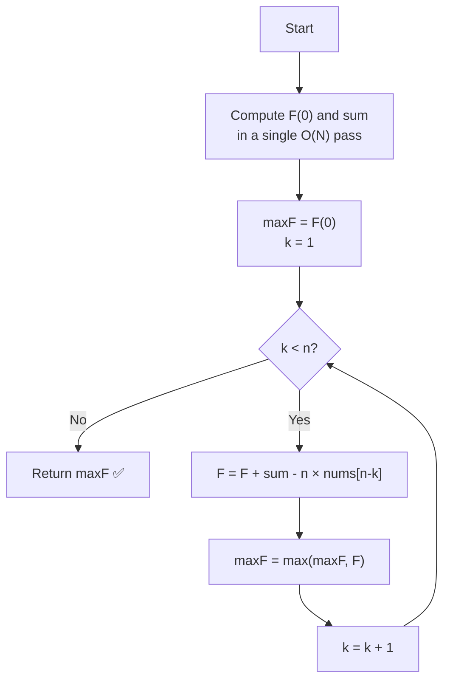

# LeetCode 396 — Rotate Function: Approach & Explanation

---

## 🔗 Related Files

| File | Description |
|:-----|:------------|
| [Problem.md](Problem.md) | Full problem statement & constraints |
| [Solution.cpp](Solution.cpp) | Optimized O(N) mathematical solution |
| [Main.cpp](Main.cpp) | Test driver with 5 sample test cases |

---

## 💡 Core Intuition

> **Key Insight:** Computing every `F(k)` from scratch would cost `O(N²)`.  
> Instead, observe that `F(k)` can be derived from `F(k-1)` in **O(1)** using a simple recurrence.
>
> Each clockwise rotation shifts all indices up by 1 (adding `sum` to the total),  
> except the last element wraps to index 0, so we lose `n × nums[n-k]`.

---

## 📐 Mathematical Derivation

### Step 1 — Write out F(0) and F(1)

```
nums = [a₀, a₁, a₂, a₃]    n = 4

F(0) = 0·a₀ + 1·a₁ + 2·a₂ + 3·a₃

After rotating right by 1:
  arr₁ = [a₃, a₀, a₁, a₂]

F(1) = 0·a₃ + 1·a₀ + 2·a₁ + 3·a₂
```

### Step 2 — Find F(1) − F(0)

```
F(1) - F(0) = (0·a₃ + 1·a₀ + 2·a₁ + 3·a₂)
            - (0·a₀ + 1·a₁ + 2·a₂ + 3·a₃)

            = (a₀ + a₁ + a₂ + a₃) - 4·a₃

            = sum  -  n · a[n-1]
```

### Step 3 — Generalize (the Recurrence)

```
F(k) = F(k-1) + sum - n · nums[n-k]

Where:
  sum = a₀ + a₁ + ... + aₙ₋₁   (constant, computed once)
  n   = length of nums
```

---

## 📊 Visualization — Example 1 (nums = [4, 3, 2, 6])

```
n = 4,   sum = 4+3+2+6 = 15

┌────────────────────────────────────────────────────────────────────┐
│  k │  Rotated Array    │  Calculation                     │  F(k) │
├────┼───────────────────┼──────────────────────────────────┼───────┤
│  0 │ [4, 3, 2, 6]      │ 0·4 + 1·3 + 2·2 + 3·6           │  25   │
│  1 │ [6, 4, 3, 2]      │ F(0) + 15 - 4·nums[3] = 25+15-24│  16   │
│  2 │ [2, 6, 4, 3]      │ F(1) + 15 - 4·nums[2] = 16+15-8 │  23   │
│  3 │ [3, 2, 6, 4]      │ F(2) + 15 - 4·nums[1] = 23+15-12│  26   │
└────┴───────────────────┴──────────────────────────────────┴───────┘

Maximum = 26  ✅
```

---

## 🔄 Mermaid Flowchart



---

## 🔍 Dry Run — Example 1 Step by Step

```
nums = [4, 3, 2, 6]    n = 4    sum = 15

── Step 0: Compute F(0) ─────────────────────────────────────
  F(0) = 0×4 + 1×3 + 2×2 + 3×6
       = 0   + 3   + 4   + 18
       = 25
  maxF = 25

── Step k=1: F(1) = F(0) + sum - n×nums[n-1] ───────────────
  = 25 + 15 - 4×nums[3]
  = 25 + 15 - 4×6
  = 40 - 24 = 16
  maxF = max(25, 16) = 25

── Step k=2: F(2) = F(1) + sum - n×nums[n-2] ───────────────
  = 16 + 15 - 4×nums[2]
  = 16 + 15 - 4×2
  = 31 - 8  = 23
  maxF = max(25, 23) = 25

── Step k=3: F(3) = F(2) + sum - n×nums[n-3] ───────────────
  = 23 + 15 - 4×nums[1]
  = 23 + 15 - 4×3
  = 38 - 12 = 26
  maxF = max(25, 26) = 26

Answer: 26  ✅
```

---

## 🔑 Why `nums[n-k]` is the Rotating Element

```
At rotation k, the element that moves from the last position
(index n-1, weight n-1) to the front (index 0, weight 0) is:

  k=1  →  nums[n-1] = nums[3]   loses weight n = 4
  k=2  →  nums[n-2] = nums[2]   loses weight n = 4
  k=3  →  nums[n-3] = nums[1]   loses weight n = 4

General: k-th rotation loses n × nums[n-k]
```

---

## ⚙️ Complexity Analysis

| Metric    | Value  | Reason                                                    |
|:----------|:-------|:----------------------------------------------------------|
| **Time**  | `O(N)` | One pass for F(0) & sum, one pass for k = 1..n-1         |
| **Space** | `O(1)` | Only scalar variables used — no extra arrays              |

---

## 🆚 Approach Comparison

| Approach | Time | Space | Notes |
|:---------|:-----|:------|:------|
| Brute Force (compute each F(k) directly) | O(N²) | O(1) | TLE for N = 10⁵ |
| **Mathematical Recurrence (optimal)**    | **O(N)** | **O(1)** | ✅ Chosen approach |

---

## 🧩 Why This Works

- All `n` rotations only shift **which element wraps around** from the back to the front.
- Every element's weight **increases by 1** each rotation → total added = `sum`.
- The single element that moved to index 0 (weight 0) from index n-1 (weight n-1) subtracts `n × that_element`.
- Together: `F(k) = F(k-1) + sum - n × nums[n-k]` — derived purely from algebra, no array construction needed.
