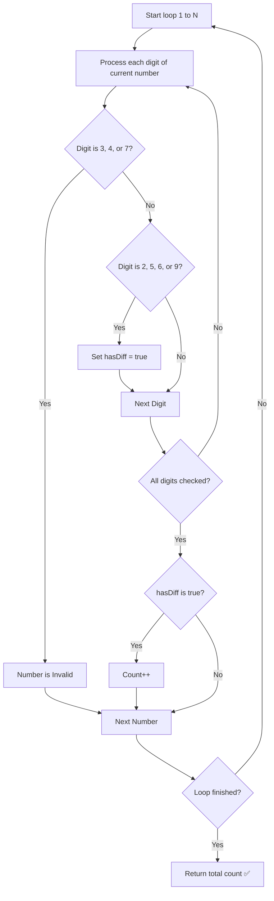

# Rotated Digits — Approach & Explanation

---

## 🔗 Related Files

| File | Description |
|:-----|:------------|
| [Problem.md](Problem.md) | Full problem statement & constraints |
| [Solution.cpp](Solution.cpp) | Optimized O(N log N) C++ solution |
| [Main.cpp](Main.cpp) | Test driver with sample test cases |

---

## 💡 Core Intuition

A number is "good" if it satisfies two conditions after 180-degree rotation:
1. **Validity**: It must only consist of digits that are valid after rotation: `{0, 1, 8, 2, 5, 6, 9}`.
2. **Difference**: At least one digit must change into a different valid digit: `{2, 5, 6, 9}`.

If a number contains any of `{3, 4, 7}`, it is **invalid**.
If a number only contains `{0, 1, 8}`, it rotates back to **itself** (not good).

---

## 🗂️ Digit Categories

| Category | Digits | Behavior |
|:---------|:-------|:---------|
| **Self-Rotating** | `0, 1, 8` | Valid, but don't change the number's value. |
| **Value-Changing** | `2, 5, 6, 9` | Valid and **required** for the number to be "good". |
| **Invalid** | `3, 4, 7` | Makes the entire number invalid. |

---

## 🪜 Algorithm

1. **Iterate** from `1` to `n`.
2. For each number, check its digits:
   - If any digit is `3`, `4`, or `7` → **Reject** (Return `false`).
   - If at least one digit is `2`, `5`, `6`, or `9` → **Mark as potentially good** (`hasDiff = true`).
3. If the number passed the validity check **and** `hasDiff` is `true` → **Increment count**.
4. **Return** total count.

---

## 📊 Visualization — Digit Rotation

```text
Digit:  0  1  2  3  4  5  6  7  8  9
        │  │  │  │  │  │  │  │  │  │
Rotate: 0  1  5  X  X  2  9  X  8  6
        (S) (S) (V)    (V) (V)    (S) (V)

S: Self-Rotating
V: Value-Changing
X: Invalid
```

---

## 🔄 Mermaid Flowchart



---

## ⚙️ Complexity Analysis

| Metric    | Value          | Reason                                              |
|:----------|:---------------|:----------------------------------------------------|
| **Time**  | `O(N log₁₀ N)` | We check every number up to N, and each check takes `log₁₀ N` digits. |
| **Space** | `O(1)`         | No extra data structures used beyond a few variables. |

---

## 🆚 Approach Comparison

| Approach | Time | Space | Notes |
|:---------|:-----|:------|:------|
| Brute Force | O(N log N) | O(1) | Simple and efficient for N = 10⁴. |
| **Digit DP** | **O(log N)** | **O(log N)** | Much faster for very large N (e.g., N = 10¹⁸). |

*Note: Since N is small (10⁴), Brute Force is perfectly fine and easier to implement.*
