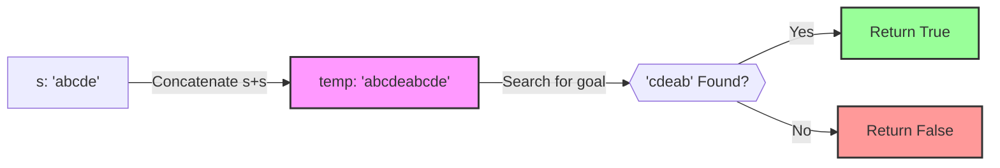

# Approach - Rotate String

  
  

---

## 💡 Intuition
A shift operation moves the first character of a string to the end. If we perform all possible shifts on a string of length $N$, we get $N$ different strings (rotations). A key observation is that if we concatenate string `s` with itself (`s + s`), this "doubled" string contains all possible cyclic rotations of `s` as substrings of length $N$.

## 🛠️ Strategy

1. **Length Validation**: If `s` and `goal` have different lengths, one cannot be a rotation of the other. Return `false`.
2. **Concatenation**: Create a temporary string `temp = s + s`.
3. **Substring Search**: Check if `goal` is a substring of `temp`. If it is, then `goal` is a valid rotation of `s`.

## 📊 Visual Representation

### Dry Run
- **Input**: `s = "abcde"`, `goal = "cdeab"`
- **Concatenated**: `"abcdeabcde"`
- **Search**:
  - `abcde...`
  - `.bcdea..`
  - `..cdeab.` (Match!)
- **Output**: `true`

---

## 📈 Complexity Analysis

| Type | Complexity | Remarks |
| :--- | :--- | :--- |
| **Time Complexity** | $O(N^2)$ | `string::find` takes $O(N \times M)$ in worst case. |
| **Space Complexity** | $O(N)$ | Required for storing the concatenated string $s+s$. |

---

## 🔗 Related Files

| File | Description |
| :--- | :--- |
| [Problem.md](Problem.md) | Problem statement & constraints |
| [Solution.cpp](Solution.cpp) | Optimized C++ solution |
| [Main.cpp](Main.cpp) | Test driver with sample test cases |
