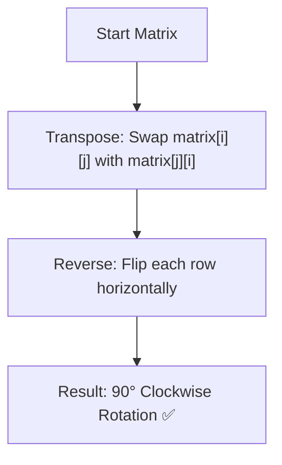

# Rotate Image — Approach & Explanation

---

## 🔗 Related Files

| File | Description |
|:-----|:------------|
| [Problem.md](Problem.md) | Full problem statement & constraints |
| [Solution.cpp](Solution.cpp) | Implementation using Transpose & Reverse |
| [Main.cpp](Main.cpp) | Test driver for verification |

---

## 💡 Core Intuition

Rotating a matrix by 90 degrees clockwise can be achieved through two simple matrix operations:
1.  **Transpose:** Reflect the matrix across its main diagonal. This turns rows into columns.
2.  **Reverse Rows:** Flip each row horizontally. This completes the 90-degree clockwise rotation.

### Mathematical Proof
- Transpose maps $(i, j) \to (j, i)$.
- Reversing rows maps $(j, i) \to (j, n-1-i)$.
- Combined, $(i, j) \to (j, n-1-i)$, which is exactly the formula for 90° clockwise rotation.

---

## 🪜 Algorithm

1.  **Step 1: Transpose**
    - Iterate through the matrix using two loops: `i` from `0` to `n-1`, and `j` from `i+1` to `n-1`.
    - Swap `matrix[i][j]` with `matrix[j][i]`.
2.  **Step 2: Reverse Rows**
    - Iterate through each row of the matrix.
    - Reverse the elements of the row using a standard reverse algorithm.

---

## 📊 Visualization — Step by Step

### Initial Matrix
| | | |
|:---:|:---:|:---:|
| 1 | 2 | 3 |
| 4 | 5 | 6 |
| 7 | 8 | 9 |

### 1. After Transpose
| | | |
|:---:|:---:|:---:|
| 1 | 4 | 7 |
| 2 | 5 | 8 |
| 3 | 6 | 9 |

### 2. After Reversing Rows (Result)
| | | |
|:---:|:---:|:---:|
| 7 | 4 | 1 |
| 8 | 5 | 2 |
| 9 | 6 | 3 |

---

## 🔄 Mermaid Flowchart

---

## ⚙️ Complexity Analysis

| Metric | Value | Reason |
|:-------|:------|:-------|
| **Time** | $O(N^2)$ | We visit every element twice (once for transpose, once for reverse). |
| **Space** | $O(1)$ | No extra space is used; operations are done in-place. |

---

## 🧩 Alternative Approach
Another method is to rotate the matrix in **four-way swaps** (circles). This involves moving groups of four elements at once. While it is $O(1)$ space and technically faster as it visits each element only once, the Transpose + Reverse method is much easier to read and less prone to index errors.
