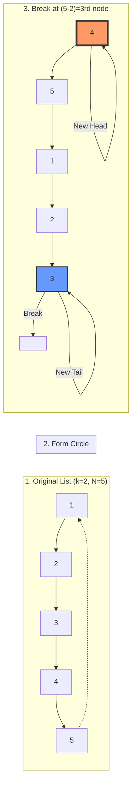

# 🚀 Approach: Rotate List

## 🔗 Quick Links
| [Problem Statement](./Problem.md) | [Solution Code](./Solution.cpp) | [Test Driver](./Main.cpp) |
| :--- | :--- | :--- |

---

## 💡 Intuition
Rotating a linked list to the right by $k$ positions can be visualized as shifting the tail $k$ times to the front. However, a more efficient way is to:
1.  Connect the end of the list to the beginning to form a **ring**.
2.  Break the ring at a specific position $(Length - k \pmod{Length})$.

This transforms a series of shifts into a single structural modification.

---

## 🛠️ Step-by-Step Logic

1.  **Calculate Length**: Traverse the list to find the total number of nodes ($N$) and keep a pointer to the **last node**.
2.  **Handle $k$**: 
    - Since rotating $N$ times results in the same list, use $k = k \pmod N$.
    - If $k = 0$, return the original head.
3.  **Form a Circle**: Link the `next` pointer of the last node to the current `head`.
4.  **Find the Breakpoint**: 
    - The new tail will be at position $N - k$ from the start.
    - Traverse $N - k$ steps from the old tail (or old head) to find the `newTail`.
5.  **Reconstruct**:
    - The `newHead` will be `newTail->next`.
    - Set `newTail->next = NULL` to break the circle.
6.  **Return** `newHead`.

---

## 📊 Visual Flow

---

## 📉 Complexity Analysis

### ⏱️ Time Complexity: $O(N)$
- First pass to find length and tail: $O(N)$.
- Second pass to find the breakpoint: at most $O(N)$.
- Total: $O(2N) \approx O(N)$.

### 空间 Complexity: $O(1)$
- We only modify a few pointers.
- No extra space proportional to the input size is used.

---

## 🏆 Key Takeaway
Making a linked list circular temporarily is a classic trick to solve rotation problems efficiently. It simplifies the logic from "finding nodes from the end" to "traversing from the start".
