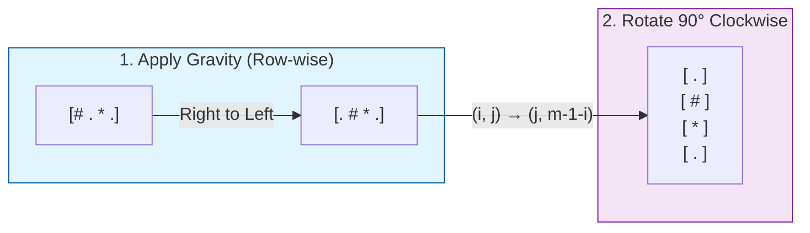

# 🚀 Approach: Rotating the Box

## 🔗 Quick Links
| [Problem Statement](./Problem.md) | [Solution Code](./Solution.cpp) | [Test Driver](./Main.cpp) |
| :--- | :--- | :--- |

---

## 💡 Intuition
The problem consists of two main parts:
1.  **Gravity Simulation**: Stones fall to the "bottom" after rotation. In the original `m x n` grid, "down" after a 90° clockwise rotation corresponds to moving to the **right** within each row.
2.  **Matrix Rotation**: A 90° clockwise rotation transforms an `m x n` matrix into an `n x m` matrix where cell `(i, j)` moves to `(j, m - 1 - i)`.

By applying gravity **before** rotation, we simplify the movement to a row-wise operation.

---

## 🛠️ Step-by-Step Logic

### **1. Apply Gravity (Row by Row)**
For each row, use a **Two-Pointer** technique:
-   Maintain an `empty_pos` pointer, initially pointing to the rightmost index (`n-1`).
-   Iterate from right to left (`j = n-1` down to `0`):
    -   If `boxGrid[i][j] == '#'`: Move the stone to `empty_pos` and decrement `empty_pos`.
    -   If `boxGrid[i][j] == '*'`: An obstacle blocks stones. Update `empty_pos` to `j - 1`.
    -   If `boxGrid[i][j] == '.'`: Do nothing (this cell could potentially be filled by a stone from the left).

### **2. Rotate the Matrix**
Create a new matrix of size `n x m`:
-   For every cell `(i, j)` in the original `m x n` grid:
    -   Place its value at `(j, m - 1 - i)` in the new grid.

---

## 🔍 Dry Run Example
**Input**: `boxGrid = [["#", ".", "*", "."]]`

**Step 1: Gravity**
- `j=3 ('.')`: `empty_pos = 3`.
- `j=2 ('*')`: `empty_pos = 2-1 = 1`.
- `j=1 ('.')`: `empty_pos = 1`.
- `j=0 ('#')`: Stone moves to `empty_pos = 1`.
- **Row after gravity**: `[".", "#", "*", "."]`

**Step 2: Rotation**
- `(0,0) -> (0,0)`, `(0,1) -> (1,0)`, `(0,2) -> (2,0)`, `(0,3) -> (3,0)`
- **Rotated Result**: `[["."], ["#"], ["*"], ["."]]`

---

## 📊 Visual Flow

---

## 📉 Complexity Analysis

### ⏱️ Time Complexity: $O(M \times N)$
- We traverse the entire matrix once for gravity ($O(M \times N)$) and once for rotation ($O(M \times N)$).
- Total time is proportional to the number of cells.

### ⌛ Complexity: $O(M \times N)$
- We create a new `n x m` matrix to store the rotated result.
- If the rotation were done in-place (difficult for non-square matrices), space could be reduced, but $O(M \times N)$ is the standard for returning a new result.

---

## 🏆 Key Takeaway
Applying gravity row-wise *before* rotating the matrix is much easier than trying to simulate falling stones in a rotated coordinate system. The two-pointer approach ensures each row is processed in linear time.
