# 📊 Comprehensive Guide to Graph Types & Representations

This document provides a thorough theoretical explanation, mathematical properties, concrete examples with vertex/edge sets, **Mermaid diagrams**, and **practice questions with solutions** for all fundamental types of graphs and their computer representations.

---

## 📑 Table of Contents
1. [What is a Graph?](#-what-is-a-graph)
2. [Graph Representations](#-graph-representations)
   - Adjacency Matrix
   - Adjacency List
   - Edge List
3. [Comprehensive Graph Types Catalog](#-comprehensive-graph-types-catalog)
   1. [Simple Graph](#1-simple-graph)
   2. [Multigraph](#2-multigraph)
   3. [Pseudograph](#3-pseudograph)
   4. [Directed Graph (Digraph)](#4-directed-graph-digraph)
   5. [Undirected Graph](#5-undirected-graph)
   6. [Weighted Graph](#6-weighted-graph)
   7. [Unweighted Graph](#7-unweighted-graph)
   8. [Complete Graph ($K_n$)](#8-complete-graph-k_n)
   9. [Null Graph ($N_n$)](#9-null-graph-n_n)
   10. [Trivial Graph](#10-trivial-graph)
   11. [Regular Graph ($k$-Regular)](#11-regular-graph-k-regular)
   12. [Cyclic Graph](#12-cyclic-graph)
   13. [Acyclic Graph](#13-acyclic-graph)
   14. [Connected Graph](#14-connected-graph)
   15. [Disconnected Graph](#15-disconnected-graph)
   16. [Bipartite Graph](#16-bipartite-graph)
   17. [Complete Bipartite Graph ($K_{m,n}$)](#17-complete-bipartite-graph-k_mn)
   18. [Tree](#18-tree)
   19. [Forest](#19-forest)
   20. [Planar Graph](#20-planar-graph)
   21. [Non-Planar Graph](#21-non-planar-graph)
   22. [Eulerian Graph](#22-eulerian-graph)
   23. [Semi-Eulerian Graph](#23-semi-eulerian-graph)
   24. [Hamiltonian Graph](#24-hamiltonian-graph)
   25. [Directed Acyclic Graph (DAG)](#25-directed-acyclic-graph-dag)
   26. [Dense Graph](#26-dense-graph)
   27. [Sparse Graph](#27-sparse-graph)
4. [Master Comparison Summary](#-master-comparison-summary)
5. [Practice Questions & Detailed Solutions](#-practice-questions--detailed-solutions)

---

## 🌐 What is a Graph?

A **Graph** $G = (V, E)$ is a non-linear data structure consisting of:
- A set of **Vertices (Nodes)**: $V = \{v_1, v_2, \dots, v_n\}$
- A set of **Edges (Links/Arcs)**: $E = \{e_1, e_2, \dots, e_m\}$ connecting pairs of vertices.

### Handshaking Lemma (Degree Sum Formula):
For any undirected graph $G = (V, E)$:
$$\sum_{v \in V} \text{deg}(v) = 2|E|$$
> **Corollary:** In every undirected graph, the number of vertices with an **odd degree** is always **even**.

---

## 🗂️ Graph Representations

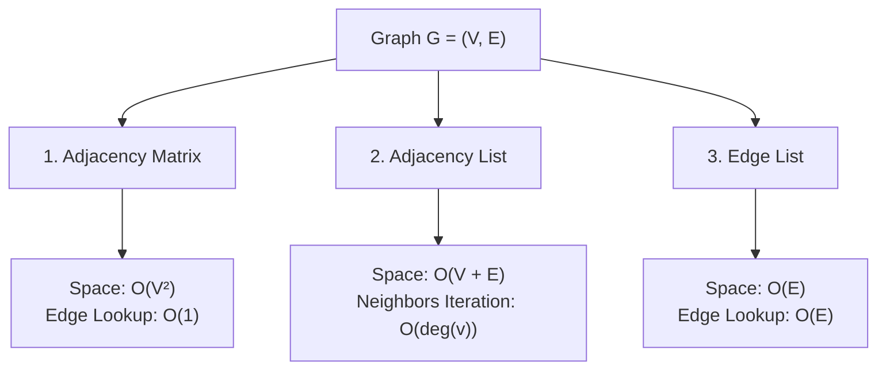

### 1. Adjacency Matrix
A 2D array of size $|V| \times |V|$ where:
$$A[i][j] = \begin{cases} 1 \text{ (or weight } w), & \text{if } (v_i, v_j) \in E \\ 0, & \text{otherwise} \end{cases}$$

### 2. Adjacency List
An array or hash map of size $|V|$, where index $i$ stores a linked list/vector of all adjacent neighbors of vertex $v_i$.

### 3. Edge List
An array of triplets $[(u_1, v_1, w_1), (u_2, v_2, w_2), \dots]$ storing each edge directly.

---

## 📚 Comprehensive Graph Types Catalog

---

### 1. Simple Graph
> **Definition:** An undirected graph with **no self-loops** and **no parallel (multiple) edges**.

- **Maximum Edges:** $|E|_{\text{max}} = \binom{n}{2} = \frac{n(n-1)}{2}$
- **Real-World Example:** Friendship network on Facebook (two people are either friends or not; no one can friend themselves twice).

#### 📌 Concrete Example:
- $V = \{A, B, C, D\}$
- $E = \{(A, B), (B, C), (C, A), (C, D)\}$
- **Degrees:** $\text{deg}(A)=2, \text{deg}(B)=2, \text{deg}(C)=3, \text{deg}(D)=1$.

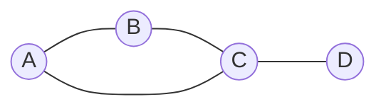

---

### 2. Multigraph
> **Definition:** A graph containing **parallel edges** (multiple edges between the same pair of vertices), but **no self-loops**.

- **Real-World Example:** Flight routes between cities (multiple flights per day operated by different airlines between New York and London).

#### 📌 Concrete Example:
- $V = \{A, B, C\}$
- $E = \{e_1:(A, B), e_2:(A, B), e_3:(B, C), e_4:(A, C)\}$
- **Property Check:** Edges $e_1$ and $e_2$ are parallel edges between $A$ and $B$.

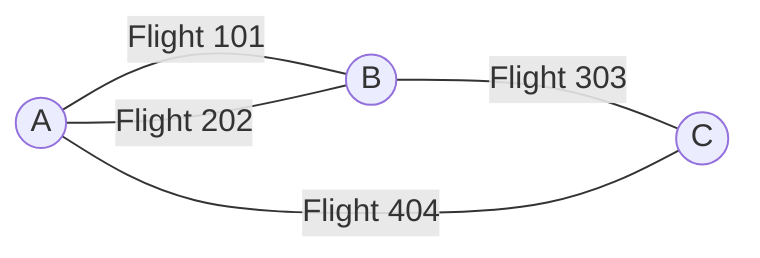

---

### 3. Pseudograph
> **Definition:** A graph containing both **parallel edges** and **self-loops** (edges connecting a vertex to itself).

- **Degree Calculation:** A self-loop contributes **+2** to the degree of that vertex.
- **Real-World Example:** Website hyperlink map where pages contain self-referencing navigation anchors (`#top`) as well as multiple links to other pages.

#### 📌 Concrete Example:
- $V = \{A, B, C\}$
- $E = \{(A, A), (A, B), (A, B), (B, C), (C, C)\}$
- **Degrees:** $\text{deg}(A) = 2(\text{loop}) + 2(\text{to } B) = 4$, $\text{deg}(B) = 2 + 1 = 3$, $\text{deg}(C) = 2(\text{loop}) + 1 = 3$.

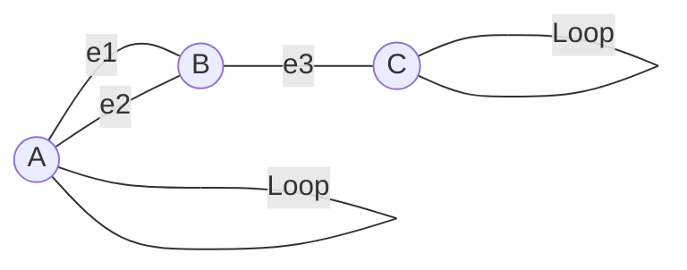

---

### 4. Directed Graph (Digraph)
> **Definition:** A graph where every edge has an assigned **direction** ($u \to v$).

- **Degree Rules:** $\text{deg}(v) = \text{in-degree}(v) + \text{out-degree}(v)$
- **Sum Rule:** $\sum \text{in-deg}(v) = \sum \text{out-deg}(v) = |E|$
- **Real-World Example:** Twitter/X follow relationships (User $A$ follows User $B$, but $B$ does not necessarily follow $A$).

#### 📌 Concrete Example:
- $V = \{A, B, C, D\}$
- $E = \{(A \to B), (B \to C), (C \to A), (A \to D), (D \to C)\}$
- **Degrees:**
  - $A$: in-deg = 1, out-deg = 2
  - $B$: in-deg = 1, out-deg = 1
  - $C$: in-deg = 2, out-deg = 1
  - $D$: in-deg = 1, out-deg = 1

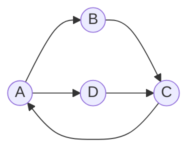

---

### 5. Undirected Graph
> **Definition:** A graph where edges are bidirectional and symmetric: $(u, v) \equiv (v, u)$.

- **Real-World Example:** LinkedIn connections (a connection is mutually shared).

#### 📌 Concrete Example:
- $V = \{1, 2, 3, 4\}$
- $E = \{(1, 2), (2, 3), (3, 4), (4, 1)\}$
- **Total Degree Sum:** $2 + 2 + 2 + 2 = 8 = 2 \times 4$ edges.

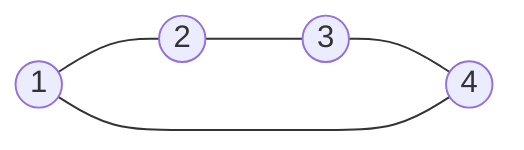

---

### 6. Weighted Graph
> **Definition:** A graph where each edge carries a numerical value, weight, or cost $w(u, v)$.

- **Real-World Example:** Road network on Google Maps with travel distances (in km) or toll costs.

#### 📌 Concrete Example:
- $V = \{\text{Delhi}, \text{Agra}, \text{Jaipur}, \text{Kanpur}\}$
- $E = \{(\text{Delhi}, \text{Agra}, 230), (\text{Delhi}, \text{Jaipur}, 280), (\text{Agra}, \text{Kanpur}, 290), (\text{Jaipur}, \text{Agra}, 240)\}$

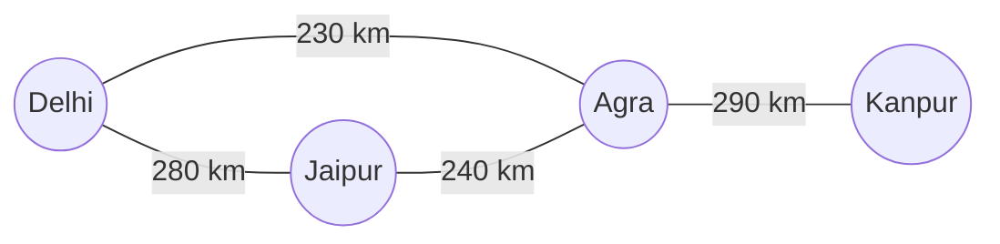

---

### 7. Unweighted Graph
> **Definition:** A graph where all edges have identical or unit weight ($w = 1$).

- **Real-World Example:** Word ladder puzzle graph (two words connected if they differ by exactly 1 letter).

#### 📌 Concrete Example:
- $V = \{\text{CAT}, \text{BAT}, \text{RAT}, \text{COT}\}$
- $E = \{(\text{CAT}, \text{BAT}), (\text{BAT}, \text{RAT}), (\text{CAT}, \text{RAT}), (\text{CAT}, \text{COT})\}$

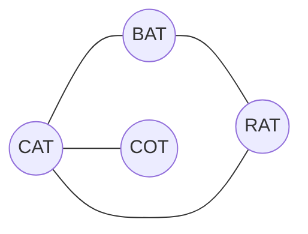

---

### 8. Complete Graph ($K_n$)
> **Definition:** A simple graph where **every pair of distinct vertices is connected by a unique edge**.

- **Formula for Total Edges:** $|E| = \frac{n(n-1)}{2}$
- **Degree of each vertex:** $\text{deg}(v) = n - 1$
- **Real-World Example:** Full-mesh computer network where every server has a dedicated direct cable to all other servers.

#### 📌 Concrete Example ($K_4$):
- $V = \{A, B, C, D\}$ ($n = 4$)
- Total Edges: $|E| = \frac{4 \times 3}{2} = 6$.
- Every vertex has $\text{deg}(v) = 3$.

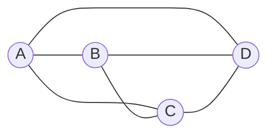

---

### 9. Null Graph ($N_n$)
> **Definition:** A graph consisting of $n$ vertices and **zero edges** ($|E| = 0$).

- **Degree of each vertex:** $\text{deg}(v) = 0$ (all vertices are isolated).
- **Real-World Example:** A set of newly initialized, unpaired wireless sensors.

#### 📌 Concrete Example ($N_4$):
- $V = \{A, B, C, D\}$, $E = \emptyset$


---

### 10. Trivial Graph
> **Definition:** A graph with only **one single vertex** and zero edges ($n = 1, m = 0$).

- **Real-World Example:** A single isolated server running locally in standalone mode.

#### 📌 Concrete Example:
- $V = \{v_0\}$, $E = \emptyset$.

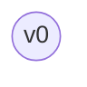

---

### 11. Regular Graph ($k$-Regular)
> **Definition:** A graph where **every vertex has the exact same degree $k$**.

- **Formula for Edges:** $|E| = \frac{n \times k}{2}$
- **Real-World Example:** Chemical structure of Benzene ring ($3$-regular) or Prism graph.

#### 📌 Concrete Example (3-Regular Cubic Graph on 6 Vertices):
- $V = \{1, 2, 3, 4, 5, 6\}$ ($n = 6, k = 3$)
- Total Edges: $|E| = \frac{6 \times 3}{2} = 9$.

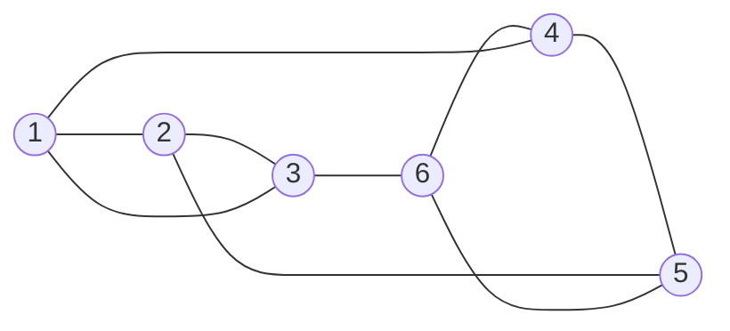

---

### 12. Cyclic Graph
> **Definition:** A graph that contains at least one **cycle** (a closed path with no repeated vertices except start and end).

- **Real-World Example:** Token Ring network protocol passing tokens in a circular loop.

#### 📌 Concrete Example:
- $V = \{1, 2, 3, 4, 5\}$
- Cycle: $1 \to 2 \to 3 \to 4 \to 1$ with attached node $5$.

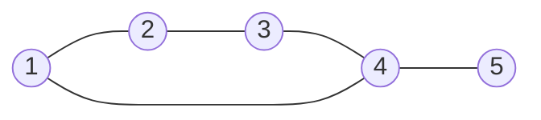

---

### 13. Acyclic Graph
> **Definition:** A graph that contains **no cycles** whatsoever.

- **Real-World Example:** Organizational company hierarchy (CEO $\to$ Managers $\to$ Employees).

#### 📌 Concrete Example:
- $V = \{A, B, C, D, E\}$
- $E = \{(A, B), (A, C), (B, D), (B, E)\}$

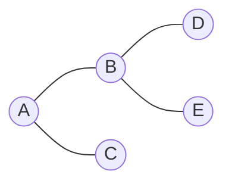

---

### 14. Connected Graph
> **Definition:** An undirected graph where there is a **path between every pair of vertices**.

- **Real-World Example:** An operational city water pipeline grid where every house is reachable from any other point.

#### 📌 Concrete Example:
- $V = \{A, B, C, D, E\}$
- Path exists from any node to any other node.

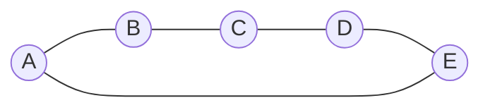

---

### 15. Disconnected Graph
> **Definition:** A graph with two or more separate, isolated subgraphs called **connected components**.

- **Real-World Example:** Islands without connecting bridges.

#### 📌 Concrete Example:
- Component 1: $V_1 = \{A, B, C\}, E_1 = \{(A, B), (B, C), (C, A)\}$
- Component 2: $V_2 = \{D, E\}, E_2 = \{(D, E)\}$

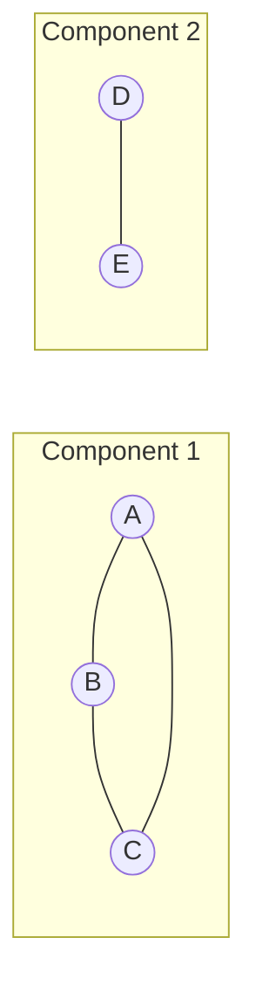

---

### 16. Bipartite Graph
> **Definition:** A graph whose vertices can be divided into two disjoint sets $V_1$ and $V_2$ such that **every edge connects a vertex in $V_1$ to a vertex in $V_2$** (no edges exist within the same set).

- **Fundamental Theorem:** A graph is bipartite $\iff$ it contains **no odd-length cycles**.
- **Real-World Example:** Job Recruitment System (Set $V_1 = \text{Candidates}$, Set $V_2 = \text{Job Roles}$).

#### 📌 Concrete Example:
- $V_1 = \{u_1, u_2, u_3\}$, $V_2 = \{v_1, v_2\}$
- $E = \{(u_1, v_1), (u_1, v_2), (u_2, v_1), (u_3, v_2)\}$

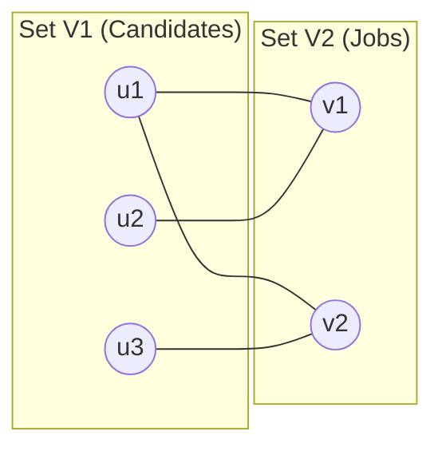

---

### 17. Complete Bipartite Graph ($K_{m, n}$)
> **Definition:** A bipartite graph where **every vertex in $V_1$ ($|V_1|=m$) connects to every vertex in $V_2$ ($|V_2|=n$)**.

- **Total Vertices:** $|V| = m + n$
- **Total Edges:** $|E| = m \times n$
- **Real-World Example:** Client-Server architecture where every client connects to all database replicas.

#### 📌 Concrete Example ($K_{2, 3}$):
- $V_1 = \{c_1, c_2\}$, $V_2 = \{s_1, s_2, s_3\}$
- Total Edges: $|E| = 2 \times 3 = 6$.

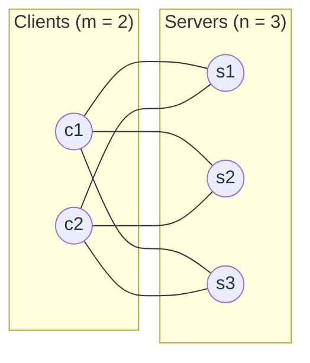

---

### 18. Tree
> **Definition:** A **connected, undirected, and acyclic** graph.

- **Fundamental Property:** $|E| = |V| - 1$
- **Uniqueness:** Exactly one simple path exists between any two vertices.
- **Real-World Example:** Unix file system directory structure (`/root`, `/home`, `/etc`).

#### 📌 Concrete Example:
- $V = \{1, 2, 3, 4, 5, 6\}$ ($|V| = 6$)
- $E = \{(1, 2), (1, 3), (2, 4), (2, 5), (3, 6)\}$ ($|E| = 5 = 6 - 1$)

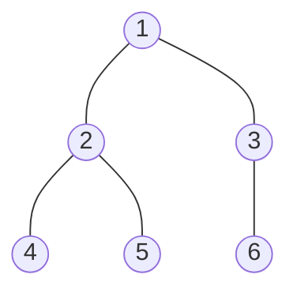

---

### 19. Forest
> **Definition:** An **acyclic graph** composed of a collection of disjoint trees.

- **Formula for Edges:** For a forest with $|V|$ vertices and $k$ trees (components):
  $$|E| = |V| - k$$
- **Real-World Example:** Active Directory forests managing separate corporate branches.

#### 📌 Concrete Example ($k = 2$ trees, $|V| = 7$):
- Tree 1: Vertices $\{A, B, C, D\}$, Edges: 3
- Tree 2: Vertices $\{E, F, G\}$, Edges: 2
- Total Edges: $|E| = 7 - 2 = 5$.

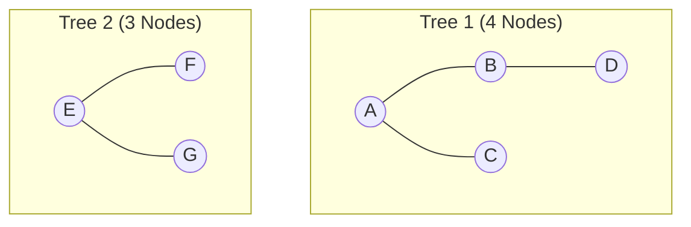

---

### 20. Planar Graph
> **Definition:** A graph that can be drawn in a single 2D plane such that **no two edges intersect or cross each other**.

- **Euler's Formula for Planar Graphs:**
  $$V - E + F = 2 \quad (F = \text{Faces/Regions including outer unbounded face})$$
- **Planarity Edge Bound (for $V \ge 3$):**
  $$E \le 3V - 6$$
- **Real-World Example:** Single-layer Printed Circuit Board (PCB) tracks without jumper wires.

#### 📌 Concrete Example ($K_4$ Planar Drawing):
- Vertices: $V = 4$, Edges: $E = 6$.
- Faces: 3 internal triangles + 1 external region = $4$ faces.
- Verification: $4 - 6 + 4 = 2$ ✅.

```mermaid
graph TD
    A((A)) --- B((B))
    B --- C((C))
    C --- D((D))
    D --- A
    A --- C
    B --- D
```

---

### 21. Non-Planar Graph
> **Definition:** A graph that **cannot** be drawn in a plane without edges crossing each other.

- **Kuratowski's Theorem:** A graph is non-planar $\iff$ it contains a subgraph homeomorphic to **$K_5$** (Complete 5-vertex graph) or **$K_{3,3}$** (Three utilities puzzle graph).
- **Real-World Example:** Three Utilities Problem: Connecting 3 houses to Gas, Water, and Electricity without overlapping pipes.

#### 📌 Concrete Example ($K_{3,3}$):
- $V = 6, E = 9$.
- Planar bound test: For bipartite planar graphs, $E \le 2V - 4 \implies 9 \le 2(6) - 4 = 8$ (False! $9 > 8$, hence Non-Planar).

```mermaid
graph LR
    subgraph Houses
        H1((House 1))
        H2((House 2))
        H3((House 3))
    end
    subgraph Utilities
        U1((Water))
        U2((Gas))
        U3((Power))
    end
    H1 --- U1
    H1 --- U2
    H1 --- U3
    H2 --- U1
    H2 --- U2
    H2 --- U3
    H3 --- U1
    H3 --- U2
    H3 --- U3
```

---

### 22. Eulerian Graph
> **Definition:** A connected graph containing an **Eulerian Circuit** (a closed path that visits **every edge exactly once** and returns to the starting vertex).

- **Euler's Theorem:** A connected graph is Eulerian $\iff$ **every vertex has an EVEN degree**.
- **Real-World Example:** Street sweeper vehicle route visiting every single street once and returning to the depot.

#### 📌 Concrete Example:
- $V = \{A, B, C, D\}$
- Degrees: $\text{deg}(A)=4, \text{deg}(B)=4, \text{deg}(C)=4, \text{deg}(D)=4$ (All Even!).
- **Eulerian Circuit:** $A \to B \to C \to D \to A \to C \to B \to D \to A$.

```mermaid
graph LR
    A((A)) --- B((B))
    B --- C((C))
    C --- D((D))
    D --- A
    A --- C
    B --- D
```

---

### 23. Semi-Eulerian Graph
> **Definition:** A connected graph containing an **Eulerian Path** (open trail visiting every edge exactly once), but **no Eulerian circuit**.

- **Euler's Condition:** Graph has **exactly TWO vertices with ODD degree** (which act as start and end of the path).
- **Real-World Example:** Classic drawing puzzle: Drawing an envelope house in one continuous pen stroke without retracing.

#### 📌 Concrete Example:
- Degrees:
  - $\text{deg}(A) = 2$ (Even)
  - $\text{deg}(B) = 3$ (Odd)
  - $\text{deg}(C) = 2$ (Even)
  - $\text{deg}(D) = 3$ (Odd)
- **Eulerian Path:** Starts at $B$ and ends at $D$: $B \to A \to D \to C \to B \to D$.

```mermaid
graph LR
    A((A)) --- B((B))
    B --- C((C))
    C --- D((D))
    D --- A
    B --- D
```

---

### 24. Hamiltonian Graph
> **Definition:** A graph containing a **Hamiltonian Cycle** (a closed loop that visits **every vertex exactly once** and returns to the start).

- **Dirac's Theorem:** If $n \ge 3$ and $\text{deg}(v) \ge \frac{n}{2}$ for all $v$, then the graph is Hamiltonian.
- **Real-World Example:** Traveling Salesperson Problem (TSP) finding the optimal tour visiting every target city once.

#### 📌 Concrete Example:
- $V = \{1, 2, 3, 4, 5\}$
- **Hamiltonian Cycle:** $1 \to 2 \to 3 \to 4 \to 5 \to 1$.

```mermaid
graph LR
    1((1)) --- 2((2))
    2 --- 3((3))
    3 --- 4((4))
    4 --- 5((5))
    5 --- 1
    1 --- 3
    2 --- 4
```

---

### 25. Directed Acyclic Graph (DAG)
> **Definition:** A directed graph with **no directed cycles**.

- **Key Feature:** Allows **Topological Sorting** (linear ordering of vertices such that for every directed edge $u \to v$, $u$ comes before $v$).
- **Real-World Example:** University course prerequisite tree, Git commit history DAG, Build automation dependencies (Makefile / Gradle).

#### 📌 Concrete Example:
- $V = \{A, B, C, D, E\}$
- $E = \{(A \to B), (A \to C), (B \to D), (C \to D), (D \to E)\}$
- **Valid Topological Ordering:** $A \to B \to C \to D \to E$.

```mermaid
graph LR
    A((A)) --> B((B))
    A --> C((C))
    B --> D((D))
    C --> D
    D --> E((E))
```

---

### 26. Dense Graph
> **Definition:** A graph where the number of edges $|E|$ is close to the maximum possible edges ($|E| \approx \mathcal{O}(|V|^2)$).

- **Optimal Representation:** **Adjacency Matrix** (stores dense connectivity compactly in $|V|^2$ bits with $\mathcal{O}(1)$ edge existence check).
- **Real-World Example:** Dense international airline routes between world capital cities.

#### 📌 Concrete Example:
- $|V| = 5$, $|E| = 9$ out of a maximum $\binom{5}{2} = 10$.

```mermaid
graph LR
    1((1)) --- 2((2))
    1 --- 3((3))
    1 --- 4((4))
    1 --- 5((5))
    2 --- 3
    2 --- 4
    2 --- 5
    3 --- 4
    4 --- 5
```

---

### 27. Sparse Graph
> **Definition:** A graph where the number of edges $|E| \ll |V|^2$, typically $|E| \approx \mathcal{O}(|V|)$.

- **Optimal Representation:** **Adjacency List** (saves massive memory: $\mathcal{O}(|V| + |E|)$ instead of $\mathcal{O}(|V|^2)$).
- **Real-World Example:** The World Wide Web (billions of web pages $|V| \approx 10^9$, but each page only links to $\approx 20$ other pages).

#### 📌 Concrete Example:
- $|V| = 6$, $|E| = 6 \ll \binom{6}{2} = 15$.

```mermaid
graph LR
    1((1)) --- 2((2))
    2 --- 3((3))
    3 --- 4((4))
    4 --- 5((5))
    5 --- 6((6))
    6 --- 1
```

---

## 📊 Master Comparison Summary

| Graph Type | Edges Condition | Degree Property | Key Formula / Rule |
| :--- | :--- | :--- | :--- |
| **Simple Graph** | No loops, no parallel | Any | $|E| \le \binom{n}{2}$ |
| **Multigraph** | Parallel edges allowed | Any | — |
| **Pseudograph** | Loops & parallel allowed | Loop adds +2 | — |
| **Directed (Digraph)** | Directed arrows | $\text{in-deg} + \text{out-deg}$ | $\sum \text{in-deg} = \sum \text{out-deg} = \|E\|$ |
| **Undirected** | Symmetric | $\text{deg}(v)$ | $\sum \text{deg}(v) = 2\|E\|$ |
| **Complete ($K_n$)** | All pairs connected | All $n - 1$ | $\|E\| = \frac{n(n-1)}{2}$ |
| **Null ($N_n$)** | Zero edges | All 0 | $\|E\| = 0$ |
| **Regular ($k$-reg)** | Uniform connections | All $k$ | $\|E\| = \frac{n \times k}{2}$ |
| **Tree** | Connected + Acyclic | $\ge 1$ | $\|E\| = \|V\| - 1$ |
| **Bipartite** | Between 2 disjoint sets | Cross-set only | No odd-length cycles |
| **Complete Bipartite ($K_{m,n}$)** | Fully inter-connected | $m$ or $n$ | $\|E\| = m \times n$ |
| **Planar** | No edge crossings | Any | $V - E + F = 2, E \le 3V - 6$ |
| **Eulerian** | Closed Euler circuit | All **Even** | Visits every edge once |
| **Semi-Eulerian** | Open Euler trail | Exactly 2 **Odd** | Starts/ends at odd nodes |
| **Hamiltonian** | Closed vertex tour | Any | Visits every vertex once |
| **DAG** | Directed + No cycles | Any | Admits Topological Sort |

---

## ❓ Practice Questions & Detailed Solutions (for All 27 Graph Types)

---

### Question 1: Simple Graph (Complement & Missing Edges)
**Problem:** In the simple graph $G$ shown below with $5$ vertices, how many edges are present, and how many additional edges are required to convert it into a Complete Graph $K_5$?

```mermaid
graph LR
    A((A)) --- B((B))
    B --- C((C))
    C --- D((D))
    D --- E((E))
    E --- A
    A --- C
```

#### Solution:
1. **Count present edges ($|E|$):**
   - Edges = $\{(A,B), (B,C), (C,D), (D,E), (E,A), (A,C)\} \implies |E| = 6$.
2. **Calculate maximum edges in $K_5$ ($|V| = 5$):**
   $$|E|_{\text{complete}} = \frac{n(n-1)}{2} = \frac{5 \times 4}{2} = 10$$
3. **Calculate missing edges:**
   $$\text{Missing Edges} = |E|_{\text{complete}} - |E| = 10 - 6 = 4$$
   The 4 missing edges are: $(A,D), (B,D), (B,E), (C,E)$.
**Answer:** The graph has **6 edges**; **4 additional edges** are required to make it complete.

---

### Question 2: Multigraph (Degree Calculation with Parallel Edges)
**Problem:** For the multigraph below, determine the degree of each vertex and verify the Handshaking Lemma.

```mermaid
graph LR
    A((A)) ---|e1| B((B))
    A ---|e2| B
    B ---|e3| C((C))
    B ---|e4| C
    C ---|e5| A
```

#### Solution:
1. **Count edges attached to each vertex:**
   - $\text{deg}(A) = e_1 + e_2 + e_5 = 3$
   - $\text{deg}(B) = e_1 + e_2 + e_3 + e_4 = 4$
   - $\text{deg}(C) = e_3 + e_4 + e_5 = 3$
2. **Sum of degrees:**
   $$\sum \text{deg}(v) = 3 + 4 + 3 = 10$$
3. **Verify Handshaking Lemma ($2|E|$ with $|E| = 5$):**
   $$2|E| = 2 \times 5 = 10 = \sum \text{deg}(v) \quad \text{✅ Verified.}$$
**Answer:** $\text{deg}(A) = 3, \text{deg}(B) = 4, \text{deg}(C) = 3$. Total degree sum = **10**.

---

### Question 3: Pseudograph (Self-Loops & Handshaking)
**Problem:** In the pseudograph below, compute the degree of vertex $A$ and vertex $B$.

```mermaid
graph LR
    A((A)) ---|e1| B((B))
    A ---|e2| B
    A ---|Loop 1| A
    B ---|Loop 2| B
```

#### Solution:
1. **Degree of $A$:**
   - 2 edges connecting to $B$ ($+2$) + 1 self-loop at $A$ (each loop contributes $+2$).
   - $\text{deg}(A) = 2 + 2 = 4$.
2. **Degree of $B$:**
   - 2 edges connecting to $A$ ($+2$) + 1 self-loop at $B$ ($+2$).
   - $\text{deg}(B) = 2 + 2 = 4$.
3. **Total Edges:** $|E| = 4 \implies 2|E| = 8 = \text{deg}(A) + \text{deg}(B)$.
**Answer:** $\text{deg}(A) = 4$ and $\text{deg}(B) = 4$.

---

### Question 4: Directed Graph (In-Degree & Out-Degree Matrix)
**Problem:** For the directed graph below, calculate the in-degree and out-degree of every vertex and verify that $\sum \text{in-deg} = \sum \text{out-deg} = |E|$.

```mermaid
graph LR
    1((1)) --> 2((2))
    2 --> 3((3))
    3 --> 1
    1 --> 4((4))
    4 --> 3
```

#### Solution:
| Vertex | Incoming Edges (In-Degree) | Outgoing Edges (Out-Degree) |
| :---: | :---: | :---: |
| **1** | from 3 $\implies \mathbf{1}$ | to 2, to 4 $\implies \mathbf{2}$ |
| **2** | from 1 $\implies \mathbf{1}$ | to 3 $\implies \mathbf{1}$ |
| **3** | from 2, from 4 $\implies \mathbf{2}$ | to 1 $\implies \mathbf{1}$ |
| **4** | from 1 $\implies \mathbf{1}$ | to 3 $\implies \mathbf{1}$ |
| **Sum** | $\sum \text{in-deg} = \mathbf{5}$ | $\sum \text{out-deg} = \mathbf{5}$ |

**Answer:** Total edges $|E| = 5$. $\sum \text{in-deg}(v) = \sum \text{out-deg}(v) = 5$.

---

### Question 5: Undirected Graph (Degree Sequence Check)
**Problem:** Find the degree sequence of the undirected graph below and determine if the number of odd-degree vertices is even.

```mermaid
graph LR
    A((A)) --- B((B))
    B --- C((C))
    C --- D((D))
    D --- A
    A --- C
```

#### Solution:
1. **Find degrees:**
   - $\text{deg}(A) = 3$ (connected to $B, C, D$) — **Odd**
   - $\text{deg}(B) = 2$ (connected to $A, C$) — **Even**
   - $\text{deg}(C) = 3$ (connected to $A, B, D$) — **Odd**
   - $\text{deg}(D) = 2$ (connected to $A, C$) — **Even**
2. **Degree Sequence (Ascending):** $[2, 2, 3, 3]$.
3. **Odd-Degree Vertices:** $\{A, C\} \implies 2$ vertices (which is an even number).
**Answer:** Degree sequence is $[2, 2, 3, 3]$. Exactly **2 vertices** have odd degrees (consistent with Handshaking Lemma).

---

### Question 6: Weighted Graph (Shortest Path Finding)
**Problem:** In the weighted graph below, find the shortest path cost from node $S$ to node $T$.

```mermaid
graph LR
    S((S)) ---|4| A((A))
    S ---|2| B((B))
    A ---|5| T((T))
    B ---|1| A
    B ---|8| T
    A ---|3| C((C))
    C ---|2| T
```

#### Solution:
1. **Evaluate all simple paths from $S$ to $T$:**
   - Path 1: $S \to A \to T \implies 4 + 5 = 9$
   - Path 2: $S \to B \to T \implies 2 + 8 = 10$
   - Path 3: $S \to B \to A \to T \implies 2 + 1 + 5 = 8$
   - Path 4: $S \to B \to A \to C \to T \implies 2 + 1 + 3 + 2 = \mathbf{8}$
   - Path 5: $S \to A \to C \to T \implies 4 + 3 + 2 = 9$
**Answer:** The minimum shortest path cost is **8** via route $S \to B \to A \to T$ or $S \to B \to A \to C \to T$.

---

### Question 7: Unweighted Graph (BFS Minimum Hop Distance)
**Problem:** In the unweighted graph below, find the minimum number of hops from vertex $1$ to vertex $6$.

```mermaid
graph LR
    1((1)) --- 2((2))
    1 --- 3((3))
    2 --- 4((4))
    3 --- 5((5))
    4 --- 6((6))
    5 --- 6
    1 --- 5
```

#### Solution:
1. **Level 0:** $\{1\}$
2. **Level 1 (Direct neighbors of 1):** $\{2, 3, 5\}$
3. **Level 2 (Neighbors of Level 1):**
   - From 2: node 4
   - From 5: node **6** (Target reached!)
**Answer:** Minimum hop distance is **2 hops** via path $1 \to 5 \to 6$.

---

### Question 8: Complete Graph $K_5$ (Properties & Triangles)
**Problem:** For the complete graph $K_5$ below:
1. What is the total number of edges?
2. How many distinct triangles (3-cycles) exist in $K_5$?

```mermaid
graph LR
    1((1)) --- 2((2))
    1 --- 3((3))
    1 --- 4((4))
    1 --- 5((5))
    2 --- 3
    2 --- 4
    2 --- 5
    3 --- 4
    3 --- 5
    4 --- 5
```

#### Solution:
1. **Total edges in $K_5$:**
   $$|E| = \binom{5}{2} = \frac{5 \times 4}{2} = 10$$
2. **Total Triangles in $K_n$:**
   Since every 3 vertices in a complete graph form a triangle:
   $$\text{Triangles} = \binom{5}{3} = \frac{5 \times 4 \times 3}{3 \times 2 \times 1} = 10$$
**Answer:** Total edges = **10**, Total distinct triangles = **10**.

---

### Question 9: Null Graph $N_4$ (Components & Adjacency)
**Problem:** For the null graph $N_4$ with vertices $\{A, B, C, D\}$:
1. How many connected components does it have?
2. Write its adjacency matrix.

```mermaid
graph LR
    A((A))
    B((B))
    C((C))
    D((D))
```

#### Solution:
1. Since no edges exist, each vertex forms an isolated component $\implies \mathbf{4}$ **connected components**.
2. **Adjacency Matrix:**
   $$A = \begin{pmatrix} 0 & 0 & 0 & 0 \\ 0 & 0 & 0 & 0 \\ 0 & 0 & 0 & 0 \\ 0 & 0 & 0 & 0 \end{pmatrix}$$
**Answer:** It has **4 connected components** and an all-zero adjacency matrix.

---

### Question 10: Trivial Graph (Graph Radius & Diameter)
**Problem:** What are the diameter, radius, and edge count of the trivial graph $G = (\{v_0\}, \emptyset)$?

```mermaid
graph LR
    v0((v0))
```

#### Solution:
- $|V| = 1, |E| = 0$.
- The distance from $v_0$ to itself is $0$.
- **Radius:** $\text{rad}(G) = 0$.
- **Diameter:** $\text{diam}(G) = 0$.
**Answer:** Edge count = **0**, Radius = **0**, Diameter = **0**.

---

### Question 11: Regular Graph (3-Regular Prism Graph)
**Problem:** Verify that the 6-vertex graph below is 3-regular and calculate its total edge count using the regularity formula.

```mermaid
graph LR
    1((1)) --- 2((2))
    2 --- 3((3))
    3 --- 1
    4((4)) --- 5((5))
    5 --- 6((6))
    6 --- 4
    1 --- 4
    2 --- 5
    3 --- 6
```

#### Solution:
1. **Check degree of each vertex:**
   - $\text{deg}(1) = \text{deg}(2) = \text{deg}(3) = \text{deg}(4) = \text{deg}(5) = \text{deg}(6) = 3$.
   - Since every vertex has degree $k = 3$, the graph is **3-regular (cubic)**.
2. **Calculate $|E|$ using $|E| = \frac{n \times k}{2}$:**
   $$|E| = \frac{6 \times 3}{2} = 9$$
**Answer:** The graph is **3-regular** with **9 edges**.

---

### Question 12: Cyclic Graph (Cycle Basis)
**Problem:** In the cyclic graph below, list the length of the shortest cycle (girth) and longest cycle.

```mermaid
graph LR
    A((A)) --- B((B))
    B --- C((C))
    C --- D((D))
    D --- A
    B --- D
    D --- E((E))
    E --- C
```

#### Solution:
1. **Cycles present:**
   - Triangle 1: $A - B - D - A$ (Length = 3)
   - Triangle 2: $B - C - D - B$ (Length = 3)
   - Triangle 3: $C - D - E - C$ (Length = 3)
   - 4-Cycle: $A - B - C - D - A$ (Length = 4)
   - 5-Cycle: $A - B - C - E - D - A$ (Length = 5)
2. **Shortest Cycle (Girth):** **3**
3. **Longest Cycle:** **5**
**Answer:** Girth (shortest cycle) = **3**, Longest cycle = **5**.

---

### Question 13: Acyclic Graph (Component & Tree Property)
**Problem:** Show that the acyclic graph below with $7$ vertices and $5$ edges consists of exactly $2$ disjoint trees.

```mermaid
graph TD
    subgraph Component 1
        1((1)) --- 2((2))
        1 --- 3((3))
        2 --- 4((4))
    end
    subgraph Component 2
        5((5)) --- 6((6))
        5 --- 7((7))
    end
```

#### Solution:
1. **Formula for Forest Components:** $|E| = |V| - k \implies 5 = 7 - k \implies k = 2$.
2. **Component 1:** 4 vertices, 3 edges, connected and acyclic $\implies$ Valid Tree.
3. **Component 2:** 3 vertices, 2 edges, connected and acyclic $\implies$ Valid Tree.
**Answer:** The graph has no cycles and consists of **$k = 2$ trees** ($5 = 7 - 2$).

---

### Question 14: Connected Graph (Bridges & Articulation Points)
**Problem:** In the connected graph below, identify any **Bridge (cut-edge)** and **Articulation Point (cut-vertex)**.

```mermaid
graph LR
    A((A)) --- B((B))
    B --- C((C))
    C --- A
    C --- D((D))
    D --- E((E))
    E --- F((F))
    F --- D
```

#### Solution:
1. **Bridge (Cut-Edge):** Removing edge $(C, D)$ disconnects $\{A, B, C\}$ from $\{D, E, F\}$. Hence, $(C, D)$ is a **Bridge**.
2. **Articulation Points (Cut-Vertices):**
   - Removing vertex $C$ disconnects $\{A, B\}$ from $\{D, E, F\}$.
   - Removing vertex $D$ disconnects $\{A, B, C\}$ from $\{E, F\}$.
**Answer:** Bridge = **Edge $(C, D)$**; Articulation Points = **Vertices $C$ and $D$**.

---

### Question 15: Disconnected Graph (Connected Components)
**Problem:** Identify all connected components and isolated vertices in the graph below.

```mermaid
graph LR
    subgraph Comp1 ["Component 1"]
        1((1)) --- 2((2))
        2 --- 3((3))
        3 --- 1
    end
    subgraph Comp2 ["Component 2"]
        4((4)) --- 5((5))
    end
    subgraph Comp3 ["Component 3"]
        6((6))
    end
```

#### Solution:
- **Component 1:** $\{1, 2, 3\}$ (Triangle subgraph)
- **Component 2:** $\{4, 5\}$ (Single edge subgraph)
- **Component 3:** $\{6\}$ (Isolated vertex component)
**Answer:** Total **3 connected components**; vertex **6** is an isolated vertex.

---

### Question 16: Bipartite Graph (2-Coloring Check)
**Problem:** Determine whether the 6-vertex cycle graph $C_6$ below is Bipartite using 2-coloring.

```mermaid
graph LR
    1((1)) --- 2((2))
    2 --- 3((3))
    3 --- 4((4))
    4 --- 5((5))
    5 --- 6((6))
    6 --- 1
```

#### Solution:
1. **Assign 2 colors (Red, Blue):**
   - Node 1: **Red**
   - Node 2: **Blue**
   - Node 3: **Red**
   - Node 4: **Blue**
   - Node 5: **Red**
   - Node 6: **Blue**
2. **Check last edge $(6, 1)$:**
   - Node 6 is **Blue** and Node 1 is **Red** $\implies$ Valid! No adjacent vertices share the same color.
3. **Partition Sets:** $V_1 = \{1, 3, 5\}$ and $V_2 = \{2, 4, 6\}$.
**Answer:** **Yes, $C_6$ is Bipartite** because it contains an even cycle (length 6) and is 2-colorable.

---

### Question 17: Complete Bipartite Graph $K_{3,3}$ (Utility Graph)
**Problem:** For the complete bipartite graph $K_{3,3}$ shown below:
1. What is the size of its maximum matching?
2. What is the degree of each vertex?

```mermaid
graph LR
    subgraph Set_A
        A1((A1))
        A2((A2))
        A3((A3))
    end
    subgraph Set_B
        B1((B1))
        B2((B2))
        B3((B3))
    end
    A1 --- B1
    A1 --- B2
    A1 --- B3
    A2 --- B1
    A2 --- B2
    A2 --- B3
    A3 --- B1
    A3 --- B2
    A3 --- B3
```

#### Solution:
1. **Maximum Matching:** We can pair $(A1, B1), (A2, B2), (A3, B3)$ $\implies$ **Size = 3**.
2. **Degree of each vertex:** Every node in $V_1$ connects to all 3 nodes in $V_2 \implies \text{deg}(v) = 3$ for all vertices.
**Answer:** Maximum matching size = **3**, Degree of every vertex = **3**.

---

### Question 18: Tree (Leaf Nodes & Edges)
**Problem:** In the tree below with $7$ vertices:
1. Identify all leaf nodes (degree 1).
2. Verify the tree edge formula $|E| = |V| - 1$.

```mermaid
graph TD
    1((1)) --- 2((2))
    1 --- 3((3))
    2 --- 4((4))
    2 --- 5((5))
    3 --- 6((6))
    3 --- 7((7))
```

#### Solution:
1. **Leaf Nodes ($\text{deg}(v) = 1$):** Nodes $\{4, 5, 6, 7\}$ (4 leaves).
2. **Internal Nodes:** $\{1, 2, 3\}$.
3. **Edge Verification:** $|V| = 7 \implies |E| = 7 - 1 = 6$ edges: $\{(1,2), (1,3), (2,4), (2,5), (3,6), (3,7)\}$.
**Answer:** Leaf nodes = **$\{4, 5, 6, 7\}$**; Edge formula verified ($|E| = 6$).

---

### Question 19: Forest (Edge Count Formula)
**Problem:** A forest with $10$ vertices consists of $3$ disjoint trees as drawn below. Compute its total edge count.

```mermaid
graph TD
    subgraph "Tree 1"
        1((1)) --- 2((2))
        1 --- 3((3))
        2 --- 4((4))
    end
    subgraph "Tree 2"
        5((5)) --- 6((6))
        6 --- 7((7))
    end
    subgraph "Tree 3"
        8((8)) --- 9((9))
        8 --- 10((10))
    end
```

#### Solution:
1. Apply Forest Edge Formula: $|E| = |V| - k$.
2. Vertices $|V| = 10$, Trees $k = 3$:
   $$|E| = 10 - 3 = 7$$
3. Direct edge sum: Tree 1 (3 edges) + Tree 2 (2 edges) + Tree 3 (2 edges) = $7$.
**Answer:** The forest contains **7 edges**.

---

### Question 20: Planar Graph (Face Count with Euler's Formula)
**Problem:** For the connected planar graph below with $6$ vertices and $9$ edges, calculate the number of enclosed and outer faces.

```mermaid
graph LR
    1((1)) --- 2((2))
    2 --- 3((3))
    3 --- 4((4))
    4 --- 5((5))
    5 --- 6((6))
    6 --- 1
    1 --- 4
    2 --- 5
```

#### Solution:
1. **Apply Euler's Planar Formula:**
   $$V - E + F = 2$$
2. Substitute $V = 6, E = 8$ (Edges: $(1,2),(2,3),(3,4),(4,5),(5,6),(6,1),(1,4),(2,5)$):
   $$6 - 8 + F = 2 \implies -2 + F = 2 \implies F = 4$$
**Answer:** The graph divides the plane into **4 faces** (3 internal regions + 1 external region).

---

### Question 21: Non-Planar Graph (Planarity Bound Violation)
**Problem:** Using the planarity edge bound for triangle-free bipartite graphs ($E \le 2V - 4$), prove that $K_{3,3}$ is Non-Planar.

```mermaid
graph LR
    subgraph A
        A1((A1))
        A2((A2))
        A3((A3))
    end
    subgraph B
        B1((B1))
        B2((B2))
        B3((B3))
    end
    A1 --- B1
    A1 --- B2
    A1 --- B3
    A2 --- B1
    A2 --- B2
    A2 --- B3
    A3 --- B1
    A3 --- B2
    A3 --- B3
```

#### Solution:
1. For $K_{3,3}$: $|V| = 6, |E| = 9$.
2. Since $K_{3,3}$ is bipartite, it has no odd cycles (smallest cycle length is 4).
3. For planar graphs with girth $\ge 4$:
   $$|E| \le 2|V| - 4$$
4. Substitute $|V| = 6$:
   $$9 \le 2(6) - 4 \implies 9 \le 8 \quad \text{❌ Contradiction!}$$
**Answer:** Since $9 > 8$, $K_{3,3}$ **cannot be drawn without crossing edges**, proving it is **Non-Planar**.

---

### Question 22: Eulerian Graph (Euler Circuit Trace)
**Problem:** Verify that the graph below is Eulerian and trace its Eulerian Circuit.

```mermaid
graph LR
    A((A)) --- B((B))
    B --- C((C))
    C --- D((D))
    D --- A
    A --- C
    B --- D
```

#### Solution:
1. **Degree Check:**
   - $\text{deg}(A) = 4, \text{deg}(B) = 4, \text{deg}(C) = 4, \text{deg}(D) = 4$
   - All vertices have **even degrees** $\implies$ Graph is **Eulerian**.
2. **Eulerian Circuit (visiting all 6 edges once):**
   $$A \to B \to C \to D \to A \to C \to B \to D \to A$$
**Answer:** The graph is **Eulerian** because all vertices have even degree (4). Circuit: $A \to B \to C \to D \to A \to C \to B \to D \to A$.

---

### Question 23: Semi-Eulerian Graph (Euler Path Endpoints)
**Problem:** In the graph below, determine why it has an Euler Path but no Euler Circuit, and identify the starting and ending nodes.

```mermaid
graph LR
    A((A)) --- B((B))
    B --- C((C))
    C --- D((D))
    D --- A
    B --- D
```

#### Solution:
1. **Degree Check:**
   - $\text{deg}(A) = 2$ (Even)
   - $\text{deg}(B) = 3$ (**Odd**)
   - $\text{deg}(C) = 2$ (Even)
   - $\text{deg}(D) = 3$ (**Odd**)
2. **Euler's Theorem:** Exactly **2 vertices have odd degrees** ($B$ and $D$).
   - Therefore, an **Eulerian Path** exists starting at $B$ (or $D$) and ending at $D$ (or $B$).
3. **Trace Path:** $B \to A \to D \to C \to B \to D$.
**Answer:** It is **Semi-Eulerian** with odd-degree endpoints at **$B$ and $D$**.

---

### Question 24: Hamiltonian Graph (Hamiltonian Cycle Trace)
**Problem:** Trace a valid Hamiltonian cycle in the graph below that visits every vertex exactly once.

```mermaid
graph LR
    1((1)) --- 2((2))
    2 --- 3((3))
    3 --- 4((4))
    4 --- 5((5))
    5 --- 1
    1 --- 3
    2 --- 4
    3 --- 5
```

#### Solution:
1. **Hamiltonian Cycle Condition:** Must visit vertices $\{1, 2, 3, 4, 5\}$ exactly once and return to the start.
2. **Cycle Trace:**
   $$1 \to 2 \to 4 \to 3 \to 5 \to 1$$
   - Vertices visited: $1, 2, 4, 3, 5$ (all 5 distinct vertices visited).
**Answer:** Valid Hamiltonian cycle is $1 \to 2 \to 4 \to 3 \to 5 \to 1$.

---

### Question 25: Directed Acyclic Graph - DAG (Topological Sort)
**Problem:** For the DAG below, find a valid Topological Ordering of tasks.

```mermaid
graph LR
    A((A)) --> B((B))
    A --> C((C))
    B --> D((D))
    C --> D
    D --> E((E))
```

#### Solution:
1. **In-degrees:** $A: 0, B: 1, C: 1, D: 2, E: 1$.
2. **Kahn's Algorithm:**
   - Pop $A$ (in-degree 0) $\implies \text{Order} = [A]$. In-degrees become $B: 0, C: 0$.
   - Pop $B \implies \text{Order} = [A, B]$. In-degree of $D$ becomes 1.
   - Pop $C \implies \text{Order} = [A, B, C]$. In-degree of $D$ becomes 0.
   - Pop $D \implies \text{Order} = [A, B, C, D]$. In-degree of $E$ becomes 0.
   - Pop $E \implies \text{Order} = [A, B, C, D, E]$.
**Answer:** Valid Topological Order is **$A \to B \to C \to D \to E$** (or $A \to C \to B \to D \to E$).

---

### Question 26: Dense Graph (Density Ratio Calculation)
**Problem:** Calculate the density $D = \frac{2|E|}{|V|(|V|-1)}$ of the 5-vertex graph below with $9$ edges.

```mermaid
graph LR
    1((1)) --- 2((2))
    1 --- 3((3))
    1 --- 4((4))
    1 --- 5((5))
    2 --- 3
    2 --- 4
    2 --- 5
    3 --- 4
    4 --- 5
```

#### Solution:
1. $|V| = 5, |E| = 9$.
2. Maximum possible edges: $|E|_{\text{max}} = \frac{5 \times 4}{2} = 10$.
3. **Density Ratio:**
   $$D = \frac{2(9)}{5(4)} = \frac{18}{20} = 0.90 \text{ (or } 90\%)$$
**Answer:** Graph density is **$0.90$ (90%)**, classifying it as a **Dense Graph**.

---

### Question 27: Sparse Graph (Memory Footprint Comparison)
**Problem:** For the sparse ring graph below with $|V| = 6$ and $|E| = 6$, compare the memory required by an Adjacency Matrix ($|V| \times |V|$) vs an Adjacency List ($|V| + 2|E|$ entries).

```mermaid
graph LR
    1((1)) --- 2((2))
    2 --- 3((3))
    3 --- 4((4))
    4 --- 5((5))
    5 --- 6((6))
    6 --- 1
```

#### Solution:
1. **Adjacency Matrix Memory:**
   $$\text{Cells} = |V|^2 = 6^2 = 36 \text{ entries}$$
2. **Adjacency List Memory:**
   $$\text{Nodes/Pointers} = |V| + 2|E| = 6 + 2(6) = 18 \text{ entries}$$
3. **Memory Savings:** Adjacency list requires $50\%$ less memory than matrix for this graph.
**Answer:** Adjacency Matrix requires **36 entries**; Adjacency List requires **18 entries** (optimal for sparse graphs).

